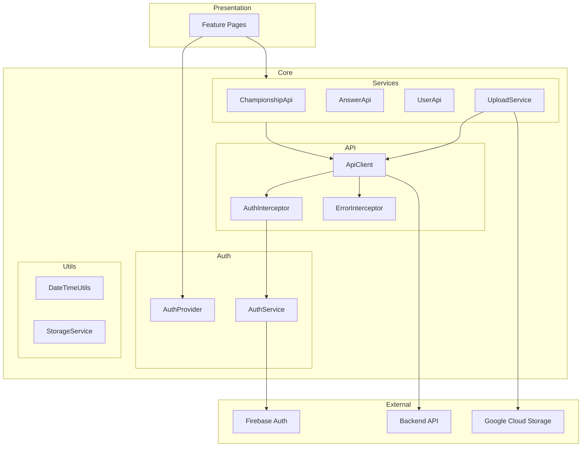
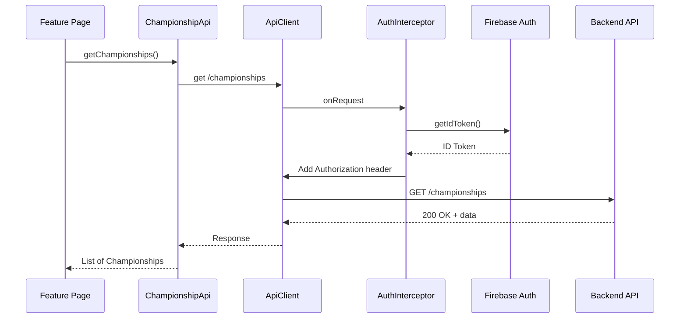
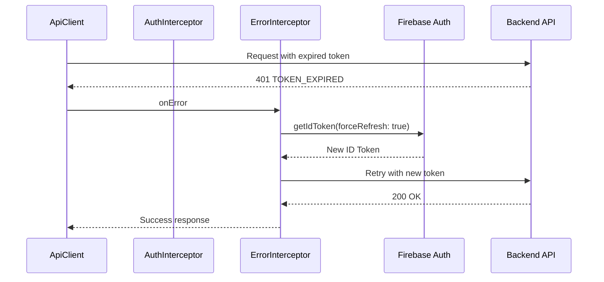
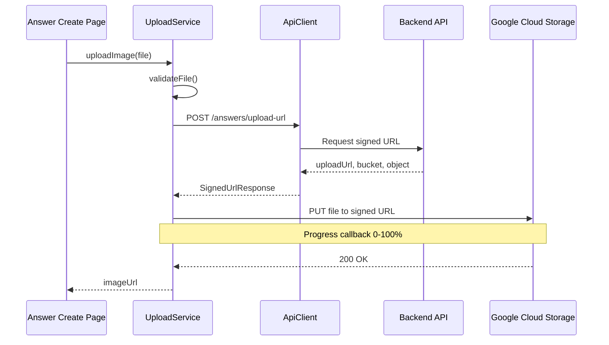
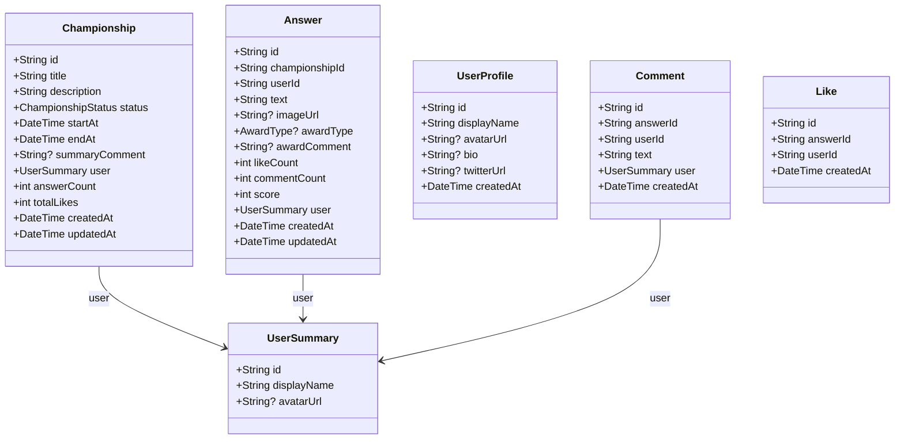

# Technical Design: Client Utility Functions

## Overview

**Purpose**: Flutterモバイルアプリケーションにおいて、バックエンドAPI通信、Firebase認証連携、共通ユーティリティを提供する基盤層を構築する。

**Users**: アプリケーション開発者が各機能画面の実装時にこれらのユーティリティを利用する。

**Impact**: 現在UIスケルトンのみのクライアントアプリに、API通信・認証・データ変換の基盤機能を追加する。

### Goals
- 型安全なAPI通信基盤の提供
- Firebase認証トークンの自動管理
- 統一されたエラーハンドリング機構
- 再利用可能なユーティリティ関数群の整備

### Non-Goals
- 画面UIの実装（別仕様で対応）
- オフラインキャッシュ機構（将来拡張）
- プッシュ通知機能（別仕様で対応）

## Architecture

### Architecture Pattern & Boundary Map



**Architecture Integration**:
- **Selected pattern**: Service Layer + Dio Interceptors — シンプルかつ拡張性のある構成
- **Domain boundaries**: API通信（ApiClient）、認証（AuthService）、ユーティリティ（Utils）を明確に分離
- **Existing patterns preserved**: Riverpodによる状態管理、Feature-firstディレクトリ構造
- **New components rationale**: Dioインターセプターで横断的関心事（認証、エラー処理）を一元管理

### Technology Stack

| Layer | Choice / Version | Role in Feature | Notes |
|-------|------------------|-----------------|-------|
| HTTP Client | dio ^5.4.0 | API通信、インターセプター、進捗通知 | インターセプター機能が認証・エラー処理に必須 |
| Authentication | firebase_auth ^5.0.0 | Firebase認証、トークン管理 | FlutterFire公式パッケージ |
| State Management | flutter_riverpod ^2.5.0 | 認証状態のリアクティブ管理 | 既存採用済み |
| Local Storage | shared_preferences ^2.2.0 | ユーザー設定の永続化 | 非機密データ用 |
| Date/Time | intl ^0.19.0 | 日付フォーマット、ローカライズ | 日本語フォーマット対応 |

## System Flows

### 認証付きAPIリクエストフロー



### トークン期限切れ時のリトライフロー



### 画像アップロードフロー



## Requirements Traceability

| Requirement | Summary | Components | Interfaces | Flows |
|-------------|---------|------------|------------|-------|
| 1.1-1.5 | HTTPクライアント基盤 | ApiClient | ApiClientService | 認証付きAPIリクエスト |
| 2.1-2.5 | 認証トークン管理 | AuthService, AuthInterceptor, AuthProvider | AuthServiceInterface | トークン期限切れリトライ |
| 3.1-3.5 | エラーハンドリング | ErrorInterceptor, ApiException | - | - |
| 4.1-4.6 | APIエンドポイント関数 | ChampionshipApi, AnswerApi, UserApi, UploadApi | 各Apiクラス | - |
| 5.1-5.4 | ページングユーティリティ | PaginatedResponse, PaginationParams | - | - |
| 6.1-6.5 | 画像アップロード | UploadService | UploadServiceInterface | 画像アップロード |
| 7.1-7.4 | 日付・時刻ユーティリティ | DateTimeUtils | - | - |
| 8.1-8.3 | ローカルストレージ | StorageService | StorageServiceInterface | - |

## Components and Interfaces

| Component | Domain/Layer | Intent | Req Coverage | Key Dependencies | Contracts |
|-----------|--------------|--------|--------------|------------------|-----------|
| ApiClient | Core/API | HTTP通信の基盤提供 | 1.1-1.5 | Dio (P0) | Service |
| AuthInterceptor | Core/API | 認証トークン自動付与 | 2.1-2.2 | AuthService (P0) | - |
| ErrorInterceptor | Core/API | エラーレスポンス変換 | 3.1-3.5 | - | - |
| AuthService | Core/Auth | Firebase認証状態管理 | 2.3-2.5 | FirebaseAuth (P0) | Service |
| AuthProvider | Core/Auth | 認証状態のRiverpod提供 | 2.4 | AuthService (P0) | State |
| ChampionshipApi | Core/Services | 選手権API呼び出し | 4.1-4.2 | ApiClient (P0) | Service |
| AnswerApi | Core/Services | 回答API呼び出し | 4.3-4.4 | ApiClient (P0) | Service |
| UserApi | Core/Services | ユーザーAPI呼び出し | 4.5 | ApiClient (P0) | Service |
| UploadService | Core/Services | 画像アップロード処理 | 6.1-6.5 | ApiClient (P0), http (P1) | Service |
| DateTimeUtils | Core/Utils | 日付変換ユーティリティ | 7.1-7.4 | intl (P1) | - |
| StorageService | Core/Utils | ローカルストレージ | 8.1-8.3 | SharedPreferences (P0) | Service |

### Core/API Layer

#### ApiClient

| Field | Detail |
|-------|--------|
| Intent | Dioベースの型安全なHTTPクライアント |
| Requirements | 1.1, 1.2, 1.3, 1.4, 1.5 |

**Responsibilities & Constraints**
- ベースURL設定と全リクエストへの適用
- GET/POST/PUT/PATCH/DELETEメソッドのサポート
- JSONシリアライズ/デシリアライズ
- タイムアウト設定（30秒）

**Dependencies**
- External: Dio ^5.4.0 — HTTPクライアント (P0)
- Inbound: AuthInterceptor — 認証ヘッダー付与 (P0)
- Inbound: ErrorInterceptor — エラー変換 (P0)

**Contracts**: Service [x]

##### Service Interface
```dart
abstract class ApiClientService {
  Future<T> get<T>(
    String path, {
    Map<String, dynamic>? queryParameters,
    T Function(Map<String, dynamic>)? fromJson,
  });

  Future<T> post<T>(
    String path, {
    dynamic data,
    T Function(Map<String, dynamic>)? fromJson,
  });

  Future<T> put<T>(
    String path, {
    dynamic data,
    T Function(Map<String, dynamic>)? fromJson,
  });

  Future<T> patch<T>(
    String path, {
    dynamic data,
    T Function(Map<String, dynamic>)? fromJson,
  });

  Future<void> delete(String path);
}
```

**Implementation Notes**
- Integration: 環境変数`API_BASE_URL`からベースURLを取得
- Validation: レスポンスステータスコードの検証はErrorInterceptorで実施

---

#### AuthInterceptor

| Field | Detail |
|-------|--------|
| Intent | リクエストにFirebase ID Tokenを自動付与 |
| Requirements | 2.1, 2.2 |

**Responsibilities & Constraints**
- 認証済みユーザーの場合、Authorizationヘッダーを付与
- 未認証ユーザーの場合はヘッダー付与をスキップ

**Dependencies**
- Outbound: AuthService — トークン取得 (P0)

**Contracts**: なし（Dio Interceptorとして実装）

**Implementation Notes**
- `InterceptorsWrapper.onRequest`でトークンを取得・付与
- `await authService.getIdToken()`で現在のトークンを取得

---

#### ErrorInterceptor

| Field | Detail |
|-------|--------|
| Intent | HTTPエラーをApiExceptionに変換、401時のリトライ処理 |
| Requirements | 3.1, 3.2, 3.3, 3.4, 3.5, 2.2, 2.3 |

**Responsibilities & Constraints**
- 4xx/5xx/ネットワークエラーの分類
- バックエンドエラーレスポンスの解析
- TOKEN_EXPIREDエラー時の自動リトライ（1回のみ）
- リトライ失敗時の認証状態クリア

**Dependencies**
- Outbound: AuthService — トークンリフレッシュ、ログアウト (P0)

**Contracts**: なし（Dio Interceptorとして実装）

**Implementation Notes**
- `InterceptorsWrapper.onError`でエラーをキャッチ
- `error.response?.statusCode`でステータスコード判定
- リトライは`dio.fetch(error.requestOptions)`で実行

---

### Core/Auth Layer

#### AuthService

| Field | Detail |
|-------|--------|
| Intent | Firebase認証の状態管理とトークン取得 |
| Requirements | 2.3, 2.4, 2.5 |

**Responsibilities & Constraints**
- Firebase AuthのUser状態監視
- ID Tokenの取得（通常/強制リフレッシュ）
- ログアウト処理

**Dependencies**
- External: firebase_auth ^5.0.0 — Firebase認証SDK (P0)

**Contracts**: Service [x]

##### Service Interface
```dart
abstract class AuthServiceInterface {
  /// 現在のユーザーを取得（未ログイン時はnull）
  User? get currentUser;

  /// ログイン状態を取得
  bool get isAuthenticated;

  /// 認証状態の変更を監視
  Stream<User?> get authStateChanges;

  /// Firebase ID Tokenを取得
  /// [forceRefresh]がtrueの場合、強制リフレッシュ
  Future<String?> getIdToken({bool forceRefresh = false});

  /// ログアウト
  Future<void> signOut();
}
```

**Implementation Notes**
- `FirebaseAuth.instance.authStateChanges()`で状態監視
- `currentUser?.getIdToken(forceRefresh)`でトークン取得

---

#### AuthProvider

| Field | Detail |
|-------|--------|
| Intent | 認証状態をRiverpodで提供 |
| Requirements | 2.4 |

**Responsibilities & Constraints**
- AuthServiceの認証状態をStreamProviderとして公開
- 画面からの認証状態参照を容易化

**Dependencies**
- Inbound: AuthService (P0)

**Contracts**: State [x]

##### State Management
```dart
/// 認証状態を監視するProvider
final authStateProvider = StreamProvider<User?>((ref) {
  final authService = ref.watch(authServiceProvider);
  return authService.authStateChanges;
});

/// 現在のユーザーを取得するProvider
final currentUserProvider = Provider<User?>((ref) {
  return ref.watch(authStateProvider).valueOrNull;
});

/// ログイン状態を取得するProvider
final isAuthenticatedProvider = Provider<bool>((ref) {
  return ref.watch(currentUserProvider) != null;
});
```

---

### Core/Services Layer

#### ChampionshipApi

| Field | Detail |
|-------|--------|
| Intent | 選手権関連APIの型安全な呼び出し |
| Requirements | 4.1, 4.2 |

**Responsibilities & Constraints**
- 選手権一覧取得（ページング、フィルタ、ソート対応）
- 選手権詳細取得、作成、強制終了、結果発表

**Dependencies**
- Outbound: ApiClient (P0)

**Contracts**: Service [x]

##### Service Interface
```dart
abstract class ChampionshipApiInterface {
  /// 選手権一覧を取得
  Future<PaginatedResponse<Championship>> getChampionships({
    int page = 1,
    int limit = 20,
    ChampionshipStatus? status,
    ChampionshipSort sort = ChampionshipSort.newest,
  });

  /// 選手権詳細を取得
  Future<ChampionshipDetail> getChampionship(String id);

  /// 選手権を作成
  Future<Championship> createChampionship({
    required String title,
    required String description,
    required int durationDays,
  });

  /// 選手権を強制終了
  Future<Championship> forceEndChampionship(String id);

  /// 結果を発表
  Future<Championship> publishResult(
    String id, {
    String? summaryComment,
  });
}
```

---

#### AnswerApi

| Field | Detail |
|-------|--------|
| Intent | 回答関連APIの型安全な呼び出し |
| Requirements | 4.3, 4.4 |

**Responsibilities & Constraints**
- 回答一覧取得、投稿、編集、受賞設定
- いいね追加、コメント一覧取得、コメント投稿

**Dependencies**
- Outbound: ApiClient (P0)

**Contracts**: Service [x]

##### Service Interface
```dart
abstract class AnswerApiInterface {
  /// 回答一覧を取得
  Future<PaginatedResponse<Answer>> getAnswers(
    String championshipId, {
    int page = 1,
    int limit = 20,
    AnswerSort sort = AnswerSort.score,
  });

  /// 回答を投稿
  Future<Answer> createAnswer(
    String championshipId, {
    required String text,
    String? imageUrl,
  });

  /// 回答を編集
  Future<Answer> updateAnswer(
    String id, {
    String? text,
    String? imageUrl,
  });

  /// 受賞を設定
  Future<Answer> setAward(
    String id, {
    required AwardType? awardType,
    String? awardComment,
  });

  /// いいねを追加
  Future<Like> addLike(String answerId);

  /// コメント一覧を取得
  Future<PaginatedResponse<Comment>> getComments(
    String answerId, {
    int page = 1,
    int limit = 20,
  });

  /// コメントを投稿
  Future<Comment> createComment(
    String answerId, {
    required String text,
  });
}
```

---

#### UserApi

| Field | Detail |
|-------|--------|
| Intent | ユーザー関連APIの型安全な呼び出し |
| Requirements | 4.5 |

**Dependencies**
- Outbound: ApiClient (P0)

**Contracts**: Service [x]

##### Service Interface
```dart
abstract class UserApiInterface {
  /// ユーザープロフィールを取得
  Future<UserProfile> getUser(String id);

  /// 自分のプロフィールを更新
  Future<UserProfile> updateMyProfile({
    String? displayName,
    String? bio,
    String? avatarUrl,
    String? twitterUrl,
  });

  /// ユーザーの選手権一覧を取得
  Future<PaginatedResponse<Championship>> getUserChampionships(
    String userId, {
    int page = 1,
    int limit = 20,
  });

  /// ユーザーの回答一覧を取得
  Future<PaginatedResponse<Answer>> getUserAnswers(
    String userId, {
    int page = 1,
    int limit = 20,
  });
}
```

---

#### UploadService

| Field | Detail |
|-------|--------|
| Intent | 署名付きURLを使用した画像アップロード |
| Requirements | 6.1, 6.2, 6.3, 6.4, 6.5 |

**Responsibilities & Constraints**
- ファイル形式検証（JPEG, PNG, GIF, WebP）
- ファイルサイズ検証（10MB以下）
- 署名付きURL取得とGCSへの直接アップロード
- アップロード進捗の通知

**Dependencies**
- Outbound: ApiClient — 署名付きURL取得 (P0)
- External: http ^1.2.0 — GCSアップロード用（Dioとは別にシンプルなPUT） (P1)

**Contracts**: Service [x]

##### Service Interface
```dart
abstract class UploadServiceInterface {
  /// 画像をアップロード
  /// [onProgress]でアップロード進捗（0.0〜1.0）を通知
  Future<String> uploadImage(
    File file, {
    void Function(double progress)? onProgress,
  });
}

/// アップロードエラー
sealed class UploadException implements Exception {
  String get message;
}

class InvalidFileTypeException extends UploadException {
  @override
  final String message = '許可されていないファイル形式です';
}

class FileTooLargeException extends UploadException {
  @override
  final String message = 'ファイルサイズが10MBを超えています';
}

class UploadFailedException extends UploadException {
  @override
  final String message;
  final bool canRetry;
  UploadFailedException(this.message, {this.canRetry = true});
}
```

---

### Core/Utils Layer

#### DateTimeUtils

| Field | Detail |
|-------|--------|
| Intent | 日付・時刻の変換ユーティリティ |
| Requirements | 7.1, 7.2, 7.3, 7.4 |

**Dependencies**
- External: intl ^0.19.0 — 日付フォーマット (P1)

**Contracts**: なし（静的メソッドクラス）

##### Utility Functions
```dart
class DateTimeUtils {
  /// ISO 8601文字列をDateTimeに変換
  static DateTime fromIso8601(String isoString);

  /// DateTimeをISO 8601文字列に変換
  static String toIso8601(DateTime dateTime);

  /// 相対時間表示に変換（「3分前」「2日前」等）
  static String toRelativeTime(DateTime dateTime);

  /// 日本語フォーマットに変換（「2024年1月15日」等）
  static String toJapaneseDate(DateTime dateTime);

  /// 日本語日時フォーマットに変換（「2024年1月15日 14:30」等）
  static String toJapaneseDateTime(DateTime dateTime);
}
```

---

#### StorageService

| Field | Detail |
|-------|--------|
| Intent | SharedPreferencesのラッパー |
| Requirements | 8.1, 8.2, 8.3 |

**Dependencies**
- External: shared_preferences ^2.2.0 — キーバリューストレージ (P0)

**Contracts**: Service [x]

##### Service Interface
```dart
abstract class StorageServiceInterface {
  /// 文字列を保存
  Future<void> setString(String key, String value);

  /// 文字列を取得
  String? getString(String key);

  /// 整数を保存
  Future<void> setInt(String key, int value);

  /// 整数を取得
  int? getInt(String key);

  /// 真偽値を保存
  Future<void> setBool(String key, bool value);

  /// 真偽値を取得
  bool? getBool(String key);

  /// JSONオブジェクトを保存
  Future<void> setJson<T>(String key, T value, Map<String, dynamic> Function(T) toJson);

  /// JSONオブジェクトを取得
  T? getJson<T>(String key, T Function(Map<String, dynamic>) fromJson);

  /// キーを削除
  Future<void> remove(String key);

  /// 全データをクリア
  Future<void> clear();
}
```

---

## Data Models

### Domain Model



### Enums

```dart
enum ChampionshipStatus {
  recruiting,  // 募集中
  selecting,   // 選定中
  announced,   // 結果発表済み
}

enum AwardType {
  grandPrize,   // 大賞
  prize,        // 入賞
  specialPrize, // 特別賞
}

enum ChampionshipSort {
  newest,   // 新着順
  popular,  // 人気順
}

enum AnswerSort {
  score,    // スコア順
  newest,   // 新着順
}
```

### Pagination Models

```dart
/// ページングレスポンス
class PaginatedResponse<T> {
  final List<T> items;
  final PaginationInfo pagination;

  bool get hasNextPage => pagination.page < pagination.totalPages;
  int get nextPageOffset => pagination.page * pagination.limit;
}

/// ページング情報
class PaginationInfo {
  final int page;
  final int limit;
  final int total;
  final int totalPages;
}

/// ページングパラメータ
class PaginationParams {
  final int page;
  final int limit;

  const PaginationParams({
    this.page = 1,
    this.limit = 20,
  });

  Map<String, dynamic> toQueryParameters() => {
    'page': page.toString(),
    'limit': limit.toString(),
  };
}
```

## Error Handling

### Error Strategy

Dartのsealed classを使用してexhaustiveなパターンマッチングを実現する。

### Error Categories

```dart
/// API例外の基底クラス
sealed class ApiException implements Exception {
  String get message;
  String? get code;
  int? get statusCode;
}

/// クライアントエラー（4xx）
class ClientException extends ApiException {
  @override
  final String message;
  @override
  final String? code;
  @override
  final int statusCode;
  final Map<String, List<String>>? details;

  ClientException({
    required this.message,
    this.code,
    required this.statusCode,
    this.details,
  });
}

/// 認証エラー（401）
class UnauthorizedException extends ApiException {
  @override
  final String message;
  @override
  final String? code;
  @override
  int get statusCode => 401;

  UnauthorizedException({
    this.message = '認証が必要です',
    this.code,
  });
}

/// 認可エラー（403）
class ForbiddenException extends ApiException {
  @override
  final String message;
  @override
  final String? code;
  @override
  int get statusCode => 403;

  ForbiddenException({
    this.message = 'アクセス権限がありません',
    this.code,
  });
}

/// リソース不在エラー（404）
class NotFoundException extends ApiException {
  @override
  final String message;
  @override
  final String? code;
  @override
  int get statusCode => 404;

  NotFoundException({
    this.message = 'リソースが見つかりません',
    this.code,
  });
}

/// 競合エラー（409）
class ConflictException extends ApiException {
  @override
  final String message;
  @override
  final String? code;
  @override
  int get statusCode => 409;

  ConflictException({
    required this.message,
    this.code,
  });
}

/// サーバーエラー（5xx）
class ServerException extends ApiException {
  @override
  final String message;
  @override
  final String? code;
  @override
  final int statusCode;

  ServerException({
    this.message = 'サーバーエラーが発生しました',
    this.code,
    this.statusCode = 500,
  });
}

/// ネットワークエラー
class NetworkException extends ApiException {
  @override
  final String message;
  @override
  String? get code => 'NETWORK_ERROR';
  @override
  int? get statusCode => null;

  NetworkException({
    this.message = 'ネットワーク接続に失敗しました',
  });
}

/// タイムアウトエラー
class TimeoutException extends ApiException {
  @override
  final String message;
  @override
  String? get code => 'TIMEOUT';
  @override
  int? get statusCode => null;

  TimeoutException({
    this.message = 'リクエストがタイムアウトしました',
  });
}
```

### Error Code Mapping

バックエンドのエラーコードをクライアント例外にマッピング:

| Backend Error Code | Client Exception |
|-------------------|------------------|
| UNAUTHORIZED, INVALID_TOKEN, TOKEN_EXPIRED | UnauthorizedException |
| FORBIDDEN, NOT_OWNER | ForbiddenException |
| NOT_FOUND, USER_NOT_FOUND, CHAMPIONSHIP_NOT_FOUND, ANSWER_NOT_FOUND | NotFoundException |
| ALREADY_LIKED | ConflictException |
| VALIDATION_ERROR, INVALID_STATUS | ClientException |
| INTERNAL_ERROR | ServerException |

## Testing Strategy

### Unit Tests
- ApiClient: 各HTTPメソッドの動作、ヘッダー設定、タイムアウト
- AuthService: トークン取得、強制リフレッシュ、ログアウト
- ErrorInterceptor: エラー分類、リトライロジック
- DateTimeUtils: 各変換関数の正確性
- StorageService: 保存・取得・削除操作

### Integration Tests
- 認証フロー: ログイン→API呼び出し→トークン期限切れ→リトライ
- アップロードフロー: ファイル検証→署名付きURL取得→GCSアップロード
- エラーハンドリング: 各種エラーレスポンスの処理

## Security Considerations

- Firebase ID Tokenは`getIdToken()`で都度取得し、メモリ内のみで保持（永続化しない）
- トークン期限切れ時は自動リフレッシュ、リフレッシュ失敗時は即座にログアウト
- shared_preferencesには非機密データのみ保存（ユーザー設定等）

## Performance & Scalability

- Dioのコネクションプールを活用（デフォルト設定）
- タイムアウト30秒で長時間のハングを防止
- ページングでデータ取得量を制限（デフォルト20件、最大100件）

