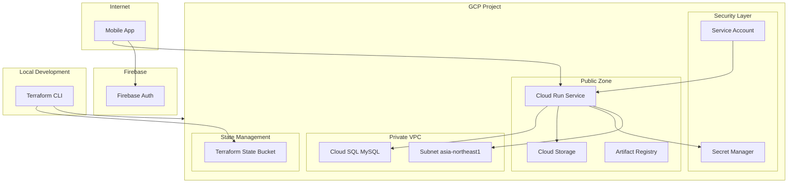
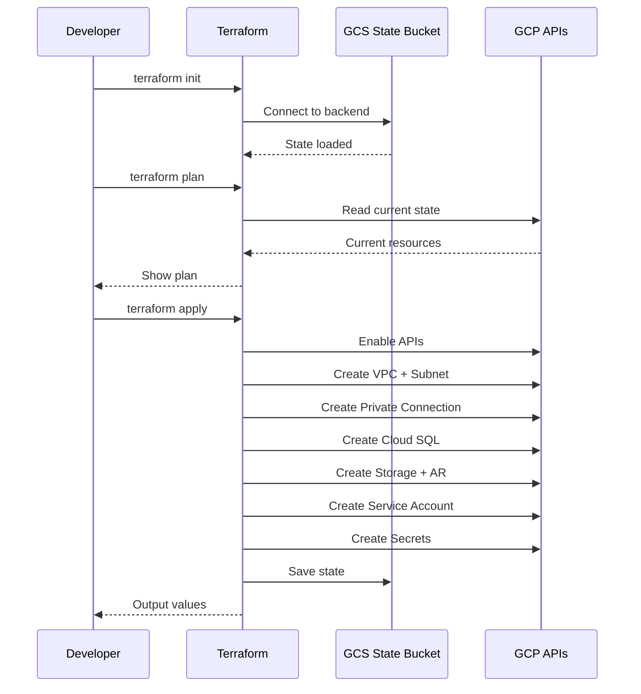
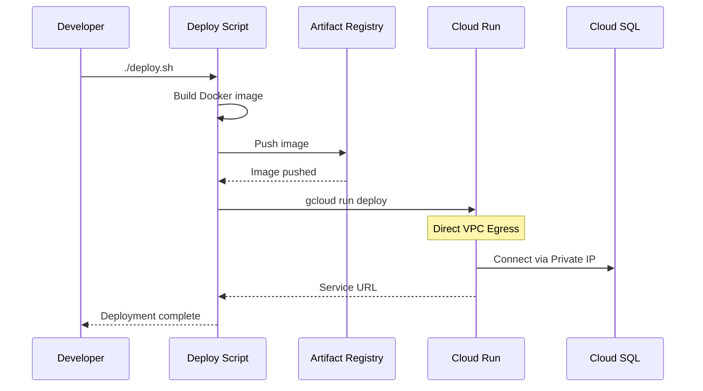

# Technical Design: GCP Infrastructure

## Overview

**Purpose**: 「みんなの選手権」アプリケーションのバックエンドAPIをホストするGCPインフラストラクチャを、Terraformで最小コスト構成で構築する。

**Users**: 開発者がTerraformを実行してインフラを構築し、Cloud Run上でバックエンドAPIを運用する。エンドユーザーはモバイルアプリ経由でAPIにアクセスする。

**Impact**: 新規インフラの構築。既存システムへの影響なし。

### Goals
- TerraformでGCPリソースを宣言的に管理
- Cloud SQLをプライベートVPC内に配置し、Direct VPC Egress経由でCloud Runから接続
- コスト最小化（db-f1-micro、最小インスタンス0、スケールtoゼロ）
- GCSバックエンドでTerraformステートを安全に管理
- Firebase手動設定手順の文書化

### Non-Goals
- 本番/ステージング環境の分離
- CI/CDパイプライン構築（手動デプロイスクリプトのみ）
- カスタムドメイン・SSL証明書設定
- 高可用性構成（マルチゾーン）

## Architecture

### Architecture Pattern & Boundary Map



**Architecture Integration**:
- **Selected pattern**: Terraform IaC（Infrastructure as Code）
- **Domain boundaries**: ネットワーク層（VPC）、コンピュート層（Cloud Run）、データ層（Cloud SQL）、セキュリティ層（IAM/Secret Manager）、ステート管理層（GCS）
- **Existing patterns preserved**: 既存のバックエンドコード構成を変更せずに対応
- **New components rationale**: 全コンポーネントは新規構築、Terraformで宣言的管理
- **Steering compliance**: 最小コスト原則に従い、db-f1-micro、最小インスタンス0を採用

### Technology Stack

| Layer | Choice / Version | Role in Feature | Notes |
|-------|------------------|-----------------|-------|
| IaC | Terraform >= 1.0 + hashicorp/google >= 5.0 | GCPリソース管理 | GCSバックエンドでステート管理 |
| Deploy Script | Bash + docker + gcloud CLI | アプリケーションデプロイ | Terraformとは別管理 |
| Compute | Cloud Run (Gen2) | バックエンドAPIホスティング | Direct VPC Egress使用 |
| Database | Cloud SQL for MySQL 8.0 | データ永続化 | db-f1-micro、プライベートIPのみ |
| Storage | Cloud Storage (Standard) | 画像保存 | asia-northeast1 |
| Container Registry | Artifact Registry | Dockerイメージ保存 | Docker形式 |
| Secrets | Secret Manager | 機密情報管理 | DATABASE_URL等 |
| Authentication | Firebase Auth | ユーザー認証 | 手動設定 |
| Network | VPC + Private Services Access | プライベート接続 | /20 IPレンジ予約 |

## System Flows

### Terraformインフラ構築フロー



### デプロイフロー



## Requirements Traceability

| Requirement | Summary | Components | Terraform Resources | Flows |
|-------------|---------|------------|---------------------|-------|
| 1.1-1.9 | GCP API有効化 | TerraformMain | google_project_service | TF Apply |
| 2.1-2.7 | VPCネットワーク構築 | TerraformNetwork | google_compute_network, google_compute_subnetwork | TF Apply |
| 3.1-3.9 | Cloud SQL構築 | TerraformDatabase | google_sql_database_instance, google_sql_database | TF Apply |
| 4.1-4.6 | Cloud Storage構築 | TerraformStorage | google_storage_bucket | TF Apply |
| 5.1-5.3 | Artifact Registry構築 | TerraformRegistry | google_artifact_registry_repository | TF Apply |
| 6.1-6.10 | Cloud Run構築 | TerraformCompute | google_cloud_run_v2_service | TF Apply |
| 7.1-7.5 | Secret Manager設定 | TerraformSecrets | google_secret_manager_secret | TF Apply |
| 8.1-8.5 | サービスアカウント設定 | TerraformIAM | google_service_account, google_project_iam_member | TF Apply |
| 9.1-9.5 | Firebase設定手順 | Documentation | - | - |
| 10.1-10.5 | デプロイ自動化 | DeployScript | - | Deploy |
| 11.1-11.5 | コスト最適化 | AllTerraformModules | - | - |
| 12.1-12.5 | Terraformステート管理 | TerraformBackend | GCS Backend | TF Init |

## Components and Interfaces

| Component | Domain/Layer | Intent | Req Coverage | Key Dependencies | Contracts |
|-----------|--------------|--------|--------------|------------------|-----------|
| TerraformMain | Infrastructure | プロジェクトAPI有効化 | 1 | google provider (P0) | HCL |
| TerraformNetwork | Network | VPC・サブネット・PSA構成 | 2 | TerraformMain (P0) | HCL |
| TerraformDatabase | Database | Cloud SQL構成 | 3, 11 | TerraformNetwork (P0) | HCL |
| TerraformStorage | Storage | Cloud Storage構成 | 4 | TerraformMain (P0) | HCL |
| TerraformRegistry | Registry | Artifact Registry構成 | 5 | TerraformMain (P0) | HCL |
| TerraformCompute | Compute | Cloud Run構成 | 6, 11 | TerraformNetwork (P0), TerraformDatabase (P1) | HCL |
| TerraformSecrets | Security | Secret Manager構成 | 7 | TerraformMain (P0) | HCL |
| TerraformIAM | Security | サービスアカウント・IAM構成 | 8 | TerraformMain (P0) | HCL |
| TerraformBackend | State | GCSバックエンド構成 | 12 | 事前作成バケット (P0) | HCL |
| DeployScript | Deployment | アプリケーションデプロイ | 10 | docker (P0), gcloud (P0) | Script |
| Documentation | Documentation | Firebase手動設定手順 | 9 | - | Doc |

### Infrastructure Layer

#### TerraformMain

| Field | Detail |
|-------|--------|
| Intent | GCPプロジェクトのAPI有効化とプロバイダー設定 |
| Requirements | 1.1-1.9 |

**Responsibilities & Constraints**
- 必要なGCP APIを有効化
- プロバイダー設定（プロジェクト、リージョン）
- 他モジュールの前提条件

**Dependencies**
- External: hashicorp/google provider >= 5.0 (P0)
- External: GCP Project with billing enabled (P0)

**Contracts**: HCL [ x ]

##### Terraform Resource Contract

```hcl
# infra/main.tf

terraform {
  required_version = ">= 1.0"
  required_providers {
    google = {
      source  = "hashicorp/google"
      version = ">= 5.0"
    }
  }
  backend "gcs" {
    bucket = "minna-senshuken-tf-state"
    prefix = "terraform/state"
  }
}

provider "google" {
  project = var.project_id
  region  = var.region
}

# APIs to enable
locals {
  apis = [
    "run.googleapis.com",
    "sqladmin.googleapis.com",
    "storage-api.googleapis.com",
    "secretmanager.googleapis.com",
    "artifactregistry.googleapis.com",
    "cloudbuild.googleapis.com",
    "compute.googleapis.com",
    "servicenetworking.googleapis.com",
  ]
}

resource "google_project_service" "apis" {
  for_each           = toset(local.apis)
  service            = each.value
  disable_on_destroy = false
}
```

**Implementation Notes**
- Integration: `disable_on_destroy = false` でterraform destroy時にAPIを無効化しない
- Validation: Terraform planで変更内容を確認
- Risks: API有効化には数秒〜数分かかる

---

#### TerraformNetwork

| Field | Detail |
|-------|--------|
| Intent | VPCネットワーク、サブネット、Private Services Accessを構成 |
| Requirements | 2.1-2.7 |

**Responsibilities & Constraints**
- カスタムVPCネットワーク作成
- サブネット作成（asia-northeast1、/24）
- Private Services Access用IPレンジ予約（/20）
- サービスネットワーキング接続確立

**Dependencies**
- Inbound: TerraformMain — API有効化 (P0)
- External: Compute Engine API (P0)
- External: Service Networking API (P0)

**Contracts**: HCL [ x ]

##### Terraform Resource Contract

```hcl
# infra/network.tf

resource "google_compute_network" "vpc" {
  name                    = "minna-senshuken-vpc"
  auto_create_subnetworks = false
  depends_on              = [google_project_service.apis]
}

resource "google_compute_subnetwork" "subnet" {
  name          = "minna-senshuken-subnet"
  ip_cidr_range = "10.0.0.0/24"
  region        = var.region
  network       = google_compute_network.vpc.id
}

resource "google_compute_global_address" "psa_range" {
  name          = "google-managed-services"
  purpose       = "VPC_PEERING"
  address_type  = "INTERNAL"
  prefix_length = 20
  network       = google_compute_network.vpc.id
}

resource "google_service_networking_connection" "psa" {
  network                 = google_compute_network.vpc.id
  service                 = "servicenetworking.googleapis.com"
  reserved_peering_ranges = [google_compute_global_address.psa_range.name]
}

output "vpc_name" {
  value = google_compute_network.vpc.name
}

output "subnet_name" {
  value = google_compute_subnetwork.subnet.name
}
```

---

#### TerraformDatabase

| Field | Detail |
|-------|--------|
| Intent | Cloud SQL for MySQL インスタンス、データベース、ユーザーを構成 |
| Requirements | 3.1-3.9, 11.1 |

**Responsibilities & Constraints**
- db-f1-micro（最小コスト）
- プライベートIPのみ（パブリックIP無効）
- 自動バックアップ有効（1日1回、7日保持）
- 高可用性無効（単一ゾーン）

**Dependencies**
- Inbound: TerraformNetwork — VPC、Private Services Access (P0)
- External: Cloud SQL Admin API (P0)

**Contracts**: HCL [ x ]

##### Terraform Resource Contract

```hcl
# infra/database.tf

resource "google_sql_database_instance" "main" {
  name             = "minna-senshuken-db"
  database_version = "MYSQL_8_0"
  region           = var.region

  settings {
    tier              = "db-f1-micro"
    availability_type = "ZONAL"
    disk_size         = 10
    disk_type         = "PD_SSD"

    ip_configuration {
      ipv4_enabled    = false
      private_network = google_compute_network.vpc.id
    }

    backup_configuration {
      enabled            = true
      start_time         = "03:00"
      binary_log_enabled = true
      backup_retention_settings {
        retained_backups = 7
      }
    }
  }

  deletion_protection = false  # Set to true in production
  depends_on          = [google_service_networking_connection.psa]
}

resource "google_sql_database" "app" {
  name     = "minna_senshuken"
  instance = google_sql_database_instance.main.name
}

resource "google_sql_user" "app" {
  name     = "app"
  instance = google_sql_database_instance.main.name
  password = random_password.db_password.result
}

resource "random_password" "db_password" {
  length  = 32
  special = false
}

output "database_instance_name" {
  value = google_sql_database_instance.main.name
}

output "database_private_ip" {
  value = google_sql_database_instance.main.private_ip_address
}
```

---

#### TerraformCompute

| Field | Detail |
|-------|--------|
| Intent | Cloud Runサービスを構成（Direct VPC Egress対応） |
| Requirements | 6.1-6.10, 11.2 |

**Responsibilities & Constraints**
- asia-northeast1リージョン
- 最小インスタンス0（コールドスタート許容）
- 最大インスタンス2
- Direct VPC Egress（private-ranges-only）
- Secret Manager参照

**Dependencies**
- Inbound: TerraformNetwork — サブネット (P0)
- Inbound: TerraformDatabase — プライベートIP (P1)
- Inbound: TerraformSecrets — シークレット (P1)
- Inbound: TerraformIAM — サービスアカウント (P0)
- External: Cloud Run API (P0)

**Contracts**: HCL [ x ]

##### Terraform Resource Contract

```hcl
# infra/compute.tf

resource "google_cloud_run_v2_service" "api" {
  name     = "minna-senshuken-api"
  location = var.region

  template {
    service_account = google_service_account.cloudrun.email

    scaling {
      min_instance_count = 0
      max_instance_count = 2
    }

    containers {
      image = "${var.region}-docker.pkg.dev/${var.project_id}/minna-senshuken/api:latest"

      resources {
        limits = {
          cpu    = "1"
          memory = "512Mi"
        }
      }

      env {
        name = "DATABASE_URL"
        value_source {
          secret_key_ref {
            secret  = google_secret_manager_secret.database_url.secret_id
            version = "latest"
          }
        }
      }

      env {
        name = "FIREBASE_PROJECT_ID"
        value_source {
          secret_key_ref {
            secret  = google_secret_manager_secret.firebase_project_id.secret_id
            version = "latest"
          }
        }
      }
    }

    vpc_access {
      network_interfaces {
        network    = google_compute_network.vpc.name
        subnetwork = google_compute_subnetwork.subnet.name
      }
      egress = "PRIVATE_RANGES_ONLY"
    }
  }

  depends_on = [
    google_project_service.apis,
    google_secret_manager_secret_version.database_url,
    google_secret_manager_secret_version.firebase_project_id,
  ]
}

resource "google_cloud_run_v2_service_iam_member" "public" {
  name     = google_cloud_run_v2_service.api.name
  location = var.region
  role     = "roles/run.invoker"
  member   = "allUsers"
}

output "cloud_run_url" {
  value = google_cloud_run_v2_service.api.uri
}
```

---

#### TerraformSecrets

| Field | Detail |
|-------|--------|
| Intent | Secret Managerでシークレットを管理 |
| Requirements | 7.1-7.5 |

**Responsibilities & Constraints**
- DATABASE_URL、FIREBASE_PROJECT_IDのシークレット作成
- プレースホルダー値で初期作成
- Cloud Runサービスアカウントへのアクセス権付与

**Dependencies**
- Inbound: TerraformMain — API有効化 (P0)
- Inbound: TerraformDatabase — 接続情報 (P1)
- External: Secret Manager API (P0)

**Contracts**: HCL [ x ]

##### Terraform Resource Contract

```hcl
# infra/secrets.tf

resource "google_secret_manager_secret" "database_url" {
  secret_id = "database-url"

  replication {
    auto {}
  }

  depends_on = [google_project_service.apis]
}

resource "google_secret_manager_secret_version" "database_url" {
  secret      = google_secret_manager_secret.database_url.id
  secret_data = "mysql://${google_sql_user.app.name}:${random_password.db_password.result}@${google_sql_database_instance.main.private_ip_address}:3306/${google_sql_database.app.name}"
}

resource "google_secret_manager_secret" "firebase_project_id" {
  secret_id = "firebase-project-id"

  replication {
    auto {}
  }

  depends_on = [google_project_service.apis]
}

resource "google_secret_manager_secret_version" "firebase_project_id" {
  secret      = google_secret_manager_secret.firebase_project_id.id
  secret_data = var.project_id  # Firebase uses same project
}

resource "google_secret_manager_secret_iam_member" "database_url_access" {
  secret_id = google_secret_manager_secret.database_url.id
  role      = "roles/secretmanager.secretAccessor"
  member    = "serviceAccount:${google_service_account.cloudrun.email}"
}

resource "google_secret_manager_secret_iam_member" "firebase_project_id_access" {
  secret_id = google_secret_manager_secret.firebase_project_id.id
  role      = "roles/secretmanager.secretAccessor"
  member    = "serviceAccount:${google_service_account.cloudrun.email}"
}

output "secret_names" {
  value = [
    google_secret_manager_secret.database_url.secret_id,
    google_secret_manager_secret.firebase_project_id.secret_id,
  ]
}
```

---

#### TerraformIAM

| Field | Detail |
|-------|--------|
| Intent | Cloud Run用サービスアカウントとIAMロールを構成 |
| Requirements | 8.1-8.5 |

**Responsibilities & Constraints**
- 最小権限原則
- Cloud SQL Client、Storage Object Admin、Secret Manager Accessor、Compute Network User

**Dependencies**
- Inbound: TerraformMain — API有効化 (P0)
- External: IAM API (P0)

**Contracts**: HCL [ x ]

##### Terraform Resource Contract

```hcl
# infra/iam.tf

resource "google_service_account" "cloudrun" {
  account_id   = "cloudrun-api"
  display_name = "Cloud Run API Service Account"
}

locals {
  cloudrun_roles = [
    "roles/cloudsql.client",
    "roles/storage.objectAdmin",
    "roles/secretmanager.secretAccessor",
    "roles/compute.networkUser",
  ]
}

resource "google_project_iam_member" "cloudrun_roles" {
  for_each = toset(local.cloudrun_roles)
  project  = var.project_id
  role     = each.value
  member   = "serviceAccount:${google_service_account.cloudrun.email}"
}

output "service_account_email" {
  value = google_service_account.cloudrun.email
}
```

---

#### TerraformStorage

| Field | Detail |
|-------|--------|
| Intent | Cloud Storageバケットを構成 |
| Requirements | 4.1-4.6 |

**Responsibilities & Constraints**
- asia-northeast1ロケーション
- Standardストレージクラス
- 均一バケットレベルアクセス
- ライフサイクルルール（90日で一時ファイル削除）

**Dependencies**
- Inbound: TerraformMain — API有効化 (P0)
- External: Cloud Storage API (P0)

**Contracts**: HCL [ x ]

##### Terraform Resource Contract

```hcl
# infra/storage.tf

resource "google_storage_bucket" "images" {
  name          = "${var.project_id}-images"
  location      = var.region
  storage_class = "STANDARD"

  uniform_bucket_level_access = true
  public_access_prevention    = "enforced"

  lifecycle_rule {
    condition {
      age            = 90
      matches_prefix = ["tmp/"]
    }
    action {
      type = "Delete"
    }
  }

  depends_on = [google_project_service.apis]
}

output "storage_bucket_name" {
  value = google_storage_bucket.images.name
}
```

---

#### TerraformRegistry

| Field | Detail |
|-------|--------|
| Intent | Artifact Registryリポジトリを構成 |
| Requirements | 5.1-5.3 |

**Responsibilities & Constraints**
- Docker形式
- asia-northeast1ロケーション

**Dependencies**
- Inbound: TerraformMain — API有効化 (P0)
- External: Artifact Registry API (P0)

**Contracts**: HCL [ x ]

##### Terraform Resource Contract

```hcl
# infra/registry.tf

resource "google_artifact_registry_repository" "docker" {
  repository_id = "minna-senshuken"
  location      = var.region
  format        = "DOCKER"

  depends_on = [google_project_service.apis]
}

output "artifact_registry_path" {
  value = "${var.region}-docker.pkg.dev/${var.project_id}/${google_artifact_registry_repository.docker.repository_id}"
}
```

---

#### DeployScript

| Field | Detail |
|-------|--------|
| Intent | バックエンドDockerイメージをビルドしCloud Runにデプロイ |
| Requirements | 10.1-10.5 |

**Responsibilities & Constraints**
- Dockerイメージのビルドとプッシュ
- Cloud Runサービスの更新（gcloud run deploy）
- Terraformとは別管理（アプリケーションデプロイのみ）

**Dependencies**
- External: docker — イメージビルド (P0)
- External: gcloud CLI — イメージプッシュ、デプロイ (P0)
- Inbound: Terraform — インフラが構築済みであること (P0)

**Contracts**: Script [ x ]

##### Script Interface

```bash
#!/bin/bash
# infra/deploy.sh

set -e

PROJECT_ID="${PROJECT_ID:?PROJECT_ID is required}"
REGION="${REGION:-asia-northeast1}"
SERVICE_NAME="minna-senshuken-api"
IMAGE="${REGION}-docker.pkg.dev/${PROJECT_ID}/minna-senshuken/api"

# Build
echo "Building Docker image..."
docker build -t "${IMAGE}:latest" -f backend/Dockerfile backend/

# Push
echo "Pushing to Artifact Registry..."
docker push "${IMAGE}:latest"

# Deploy
echo "Deploying to Cloud Run..."
gcloud run deploy "${SERVICE_NAME}" \
  --image="${IMAGE}:latest" \
  --region="${REGION}" \
  --project="${PROJECT_ID}"

# Output
URL=$(gcloud run services describe "${SERVICE_NAME}" \
  --region="${REGION}" \
  --project="${PROJECT_ID}" \
  --format="value(status.url)")

echo "Deployment complete!"
echo "Service URL: ${URL}"
```

---

### Documentation Layer

#### Documentation

| Field | Detail |
|-------|--------|
| Intent | Firebase手動設定手順を文書化 |
| Requirements | 9.1-9.5 |

**Responsibilities & Constraints**
- Firebaseプロジェクト作成手順
- Firebase Authentication設定手順
- Flutter用設定ファイル取得手順
- バックエンド用サービスアカウント設定手順

**Contracts**: Doc [ x ]

##### Documentation Content

```markdown
# Firebase設定手順

## 1. Firebaseプロジェクト作成
1. https://console.firebase.google.com/ にアクセス
2. 「プロジェクトを追加」をクリック
3. 既存のGCPプロジェクトを選択
4. Google Analyticsは無効で可

## 2. Firebase Authentication設定
1. Authenticationセクションを開く
2. 「始める」をクリック
3. ログイン方法タブで「Google」を有効化
4. プロジェクトのサポートメールを設定

## 3. Flutter設定
1. プロジェクト設定 > アプリを追加
2. iOS/Androidそれぞれ追加
3. 設定ファイル（google-services.json、GoogleService-Info.plist）をダウンロード
4. FlutterFire CLIで設定: flutterfire configure

## 4. バックエンド設定
1. プロジェクト設定 > サービスアカウント
2. 「新しい秘密鍵を生成」でJSONキーを取得
3. Secret ManagerにFIREBASE_SERVICE_ACCOUNT_KEYとして保存（オプション）

## 5. 必要な環境変数
- FIREBASE_PROJECT_ID: Firebaseプロジェクト ID（Terraform outputから取得）
- FIREBASE_SERVICE_ACCOUNT_KEY: サービスアカウントJSON（オプション、ADC使用時は不要）
```

## Data Models

本フィーチャーはインフラ構築のため、データモデルの変更なし。既存のPrismaスキーマをそのまま使用。

## Error Handling

### Error Strategy

Terraformは宣言的なため、エラーハンドリングはプラン/アプライ時に自動実行:

1. **Plan Phase**: 変更内容を事前確認、エラー検出
2. **Apply Phase**: 失敗時は部分適用、ステートに記録
3. **Rollback**: `terraform destroy` または手動修正後に再適用

### Error Categories and Responses

| Error Type | Example | Response |
|------------|---------|----------|
| Provider認証エラー | `Failed to authenticate` | gcloud auth設定を確認 |
| API未有効化 | `API not enabled` | google_project_service リソース確認 |
| 権限不足 | `Permission denied` | IAMロール確認 |
| リソース重複 | `Already exists` | terraform importでステートに取り込み |
| クォータ超過 | `Quota exceeded` | クォータ増加申請 |
| 依存関係エラー | `Resource not found` | depends_on確認 |

### Monitoring

- Cloud Run: Cloud Loggingで自動ログ収集
- Cloud SQL: Cloud Monitoringダッシュボード
- Terraform: ステート変更履歴（GCSバージョニング）

## Testing Strategy

### Unit Tests
Terraformモジュールのため該当なし（バリデーションはterraform validateで実施）

### Integration Tests
- `terraform plan` で変更内容確認
- `terraform apply` 後のリソース存在確認
- Cloud Run → Cloud SQL接続確認（ヘルスチェックエンドポイント）
- Cloud Run → Cloud Storage接続確認（テストファイルアップロード）

### E2E Tests
- モバイルアプリからのAPI呼び出し確認
- Firebase Authentication経由のログイン確認

## Security Considerations

### Service Account Permissions (Least Privilege)

| Service Account | Roles | Purpose |
|----------------|-------|---------|
| Cloud Run SA | Cloud SQL Client | Cloud SQL接続 |
| Cloud Run SA | Storage Object Admin | Cloud Storage読み書き |
| Cloud Run SA | Secret Manager Secret Accessor | シークレット読み取り |
| Cloud Run SA | Compute Network User | VPCアクセス |

### Network Security

- Cloud SQLはパブリックIP無効、プライベートIPのみ
- Cloud Runからのみアクセス可能（VPCピアリング経由）
- Direct VPC Egress でCloud RunサブネットからのEgressを制御

### Secret Management

- DATABASE_URL、FIREBASE_PROJECT_IDはSecret Managerで管理
- Terraformでシークレット作成、値は自動生成または変数から
- シークレットローテーションは手動（初期構成）
- Terraformステートにシークレットが含まれるため、GCSバケットのアクセス制御を厳格に

## Performance & Scalability

### Current Configuration (Cost Optimized)

| Resource | Setting | Implication |
|----------|---------|-------------|
| Cloud SQL | db-f1-micro | 低スループット、開発/テスト向け |
| Cloud Run | min=0, max=2 | コールドスタートあり、低コスト |

### Scaling Path

将来的なスケールアップパス（Terraform変数で変更可能）:
1. Cloud SQL: `tier` 変数を `db-g1-small` → `db-custom-1-3840` に変更
2. Cloud Run: `max_instance_count` 増加、`min_instance_count=1` でウォームスタート
3. Cloud Run: `memory` を `1Gi` → `2Gi` に変更

## Supporting References

### Terraform Variables

```hcl
# infra/variables.tf

variable "project_id" {
  description = "GCP Project ID"
  type        = string
}

variable "region" {
  description = "GCP Region"
  type        = string
  default     = "asia-northeast1"
}
```

### Terraform Outputs

```hcl
# infra/outputs.tf

output "cloud_run_url" {
  description = "Cloud Run service URL"
  value       = google_cloud_run_v2_service.api.uri
}

output "database_private_ip" {
  description = "Cloud SQL private IP"
  value       = google_sql_database_instance.main.private_ip_address
  sensitive   = true
}

output "storage_bucket_name" {
  description = "Cloud Storage bucket name"
  value       = google_storage_bucket.images.name
}

output "artifact_registry_path" {
  description = "Artifact Registry repository path"
  value       = "${var.region}-docker.pkg.dev/${var.project_id}/${google_artifact_registry_repository.docker.repository_id}"
}

output "service_account_email" {
  description = "Cloud Run service account email"
  value       = google_service_account.cloudrun.email
}
```

### 推定月額コスト

| Resource | Configuration | Estimated Cost |
|----------|---------------|----------------|
| Cloud SQL | db-f1-micro, 10GB SSD | ~$10/month |
| Cloud Run | 0-2 instances, idle | ~$0-5/month |
| Cloud Storage | Standard, minimal usage | ~$1/month |
| Artifact Registry | Minimal images | ~$1/month |
| GCS State Bucket | < 1MB | ~$0/month |
| **Total** | | **~$12-17/month** |

※ 実際のコストは使用量により変動

### ファイル構成

```
infra/
├── main.tf           # Provider設定、API有効化
├── variables.tf      # 入力変数
├── outputs.tf        # 出力値
├── network.tf        # VPC、サブネット、PSA
├── database.tf       # Cloud SQL
├── storage.tf        # Cloud Storage
├── registry.tf       # Artifact Registry
├── compute.tf        # Cloud Run
├── secrets.tf        # Secret Manager
├── iam.tf            # サービスアカウント、IAM
├── deploy.sh         # デプロイスクリプト
└── README.md         # セットアップ手順
```
