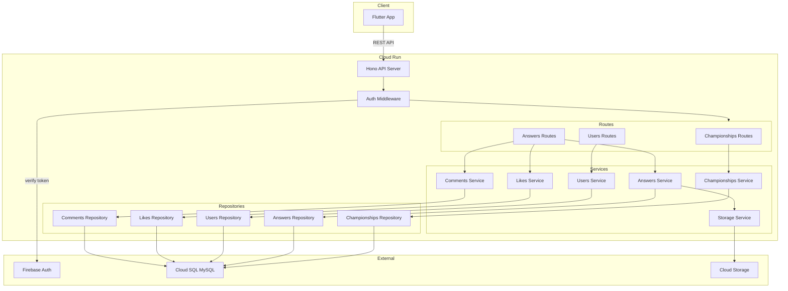
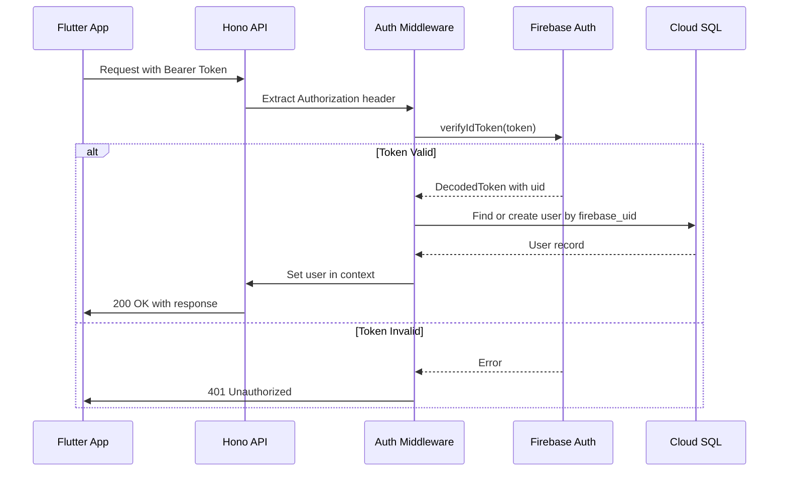
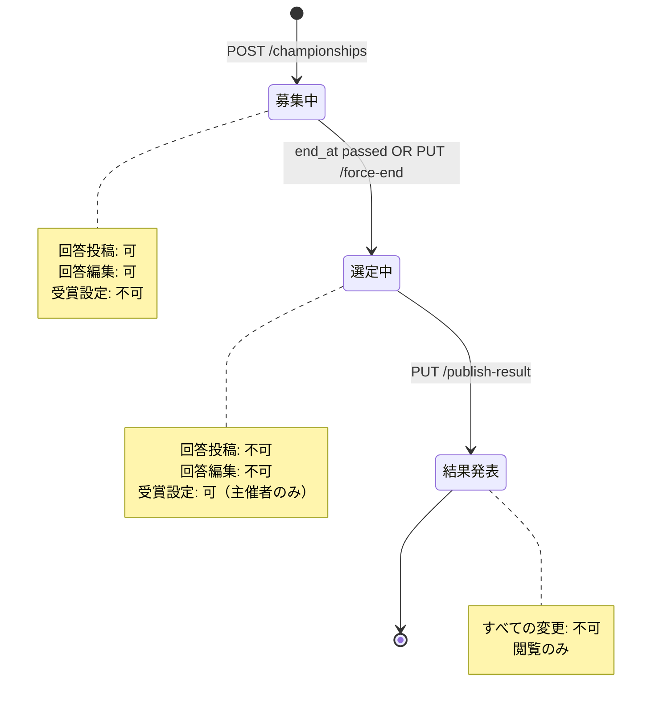
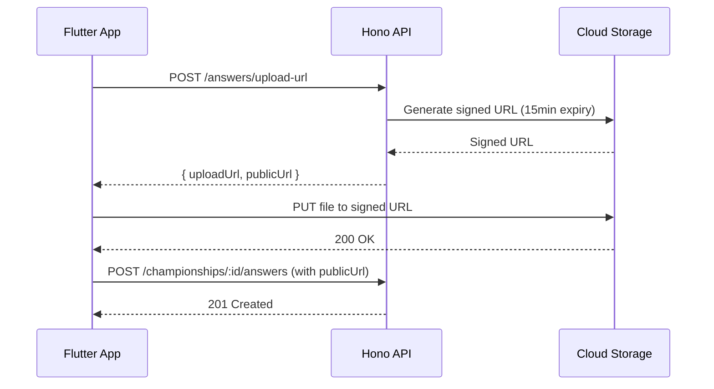
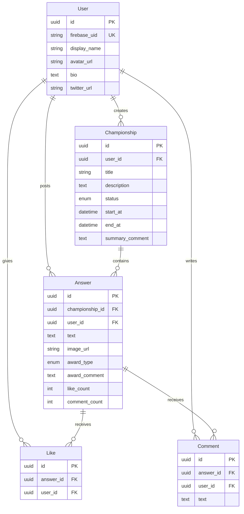

# Design Document: implement-backend

## Overview

**Purpose**: 「みんなの選手権」アプリケーションのバックエンドAPIを提供し、モバイルアプリからの選手権・回答・ユーザー管理機能を実現する。

**Users**: Flutterモバイルアプリが本APIを使用し、ユーザーは選手権の作成・参加、回答投稿、いいね・コメント機能を利用する。

**Impact**: 新規システム構築（グリーンフィールド）。Cloud Run上でHonoフレームワークを使用したREST APIをホスティングする。

### Goals
- Firebase Authenticationと連携した安全な認証基盤の構築
- 選手権のライフサイクル管理（募集中→選定中→結果発表）
- 回答投稿・編集と受賞設定機能の提供
- いいね・コメントによるインタラクション機能
- Cloud Storageへの画像アップロード機能

### Non-Goals
- リアルタイム通知（WebSocket/SSE）
- 管理者向け管理画面
- バッチ処理による定期的なデータ集計
- 外部SNS連携機能

## Architecture

### Architecture Pattern & Boundary Map



**Architecture Integration**:
- **Selected pattern**: モジュラーモノリス — 機能別モジュール（Routes→Services→Repositories）で関心を分離
- **Domain boundaries**: Championships, Answers, Users, Interactions（Like/Comment）の4ドメイン
- **New components rationale**: 全コンポーネント新規構築（グリーンフィールド）

### Technology Stack

| Layer | Choice / Version | Role in Feature | Notes |
|-------|------------------|-----------------|-------|
| Backend Framework | Hono 4.x | REST APIルーティング、ミドルウェア | 軽量・高速、Cloud Run最適化 |
| Runtime | Node.js 20 LTS | JavaScript実行環境 | Cloud Run標準サポート |
| ORM | Prisma 5.x | データベースアクセス、マイグレーション | 型安全なクエリビルダー |
| Database | Cloud SQL MySQL 8.0 | データ永続化 | マネージドMySQL |
| Authentication | Firebase Admin SDK 12.x | IDトークン検証 | サービスアカウント認証 |
| Storage | @google-cloud/storage 7.x | 署名付きURL生成 | 画像アップロード用 |
| Validation | Zod 3.x | 入力バリデーション | Honoとの統合、型推論 |
| Infrastructure | Cloud Run | APIホスティング | 自動スケーリング、ゼロスケール |

## System Flows

### 認証フロー



### 選手権ライフサイクル



### 画像アップロードフロー



## Requirements Traceability

| Requirement | Summary | Components | Interfaces | Flows |
|-------------|---------|------------|------------|-------|
| 1.1-1.5 | プロジェクト基盤 | API Server, Config | - | - |
| 2.1-2.6 | データベーススキーマ | All Repositories | Prisma Schema | - |
| 3.1-3.5 | 認証ミドルウェア | Auth Middleware | AuthService | 認証フロー |
| 4.1-4.7 | 選手権API | Championships Routes/Service/Repo | ChampionshipsAPI | ライフサイクル |
| 5.1-5.7 | 回答API | Answers Routes/Service/Repo | AnswersAPI | アップロード |
| 6.1-6.3 | いいねAPI | Likes Service/Repo | LikesAPI | - |
| 7.1-7.3 | コメントAPI | Comments Service/Repo | CommentsAPI | - |
| 8.1-8.5 | ユーザーAPI | Users Routes/Service/Repo | UsersAPI | - |
| 9.1-9.4 | エラーハンドリング | Error Handler | ErrorResponse | - |
| 10.1-10.2 | ステータス自動遷移 | Championships Service | computeStatus() | ライフサイクル |

## Components and Interfaces

| Component | Domain/Layer | Intent | Req Coverage | Key Dependencies | Contracts |
|-----------|--------------|--------|--------------|------------------|-----------|
| API Server | Infrastructure | Honoアプリケーション初期化、ルート統合 | 1.1, 1.5 | Hono (P0) | - |
| Auth Middleware | Middleware | Firebase IDトークン検証 | 3.1-3.5 | Firebase Admin (P0) | Service |
| Championships Routes | Routes | 選手権エンドポイント定義 | 4.1-4.7 | ChampionshipsService (P0) | API |
| Answers Routes | Routes | 回答エンドポイント定義 | 5.1-5.7, 6.1-6.3, 7.1-7.3 | AnswersService (P0) | API |
| Users Routes | Routes | ユーザーエンドポイント定義 | 8.1-8.5 | UsersService (P0) | API |
| Championships Service | Service | 選手権ビジネスロジック | 4.1-4.7, 10.1-10.2 | ChampionshipsRepo (P0) | Service |
| Answers Service | Service | 回答ビジネスロジック | 5.1-5.7 | AnswersRepo (P0), StorageService (P1) | Service |
| Users Service | Service | ユーザービジネスロジック | 8.1-8.5 | UsersRepo (P0) | Service |
| Likes Service | Service | いいねビジネスロジック | 6.1-6.3 | LikesRepo (P0), AnswersRepo (P1) | Service |
| Comments Service | Service | コメントビジネスロジック | 7.1-7.3 | CommentsRepo (P0), AnswersRepo (P1) | Service |
| Storage Service | Service | GCS署名付きURL生成 | 5.5 | @google-cloud/storage (P0) | Service |
| All Repositories | Repository | Prismaデータアクセス | 2.1-2.6 | PrismaClient (P0) | - |
| Error Handler | Middleware | 統一エラーレスポンス | 9.1-9.4 | - | - |

### Middleware Layer

#### Auth Middleware

| Field | Detail |
|-------|--------|
| Intent | Firebase IDトークンを検証し、ユーザー情報をコンテキストに設定 |
| Requirements | 3.1, 3.2, 3.3, 3.4, 3.5 |

**Responsibilities & Constraints**
- Authorizationヘッダーからbearer token抽出
- Firebase Admin SDKでトークン検証
- 検証成功時はユーザー情報をContext変数に設定
- 公開エンドポイント用にオプショナル認証も提供

**Dependencies**
- External: Firebase Admin SDK — トークン検証 (P0)
- Outbound: UsersRepository — ユーザー検索/作成 (P1)

**Contracts**: Service [x]

##### Service Interface
```typescript
interface AuthMiddleware {
  // 認証必須ミドルウェア
  requireAuth(): MiddlewareHandler;

  // 認証任意ミドルウェア（ユーザー情報があれば設定）
  optionalAuth(): MiddlewareHandler;
}

// Honoコンテキスト変数型
interface AuthContext {
  user: {
    id: string;           // UUIDv4
    firebaseUid: string;
    displayName: string;
  } | null;
}
```
- Preconditions: Authorizationヘッダーがある場合、Bearer形式であること
- Postconditions: 認証成功時、c.set('user', user)でユーザー情報設定
- Invariants: 無効なトークンでは401を返す

### Routes Layer

#### Championships Routes

| Field | Detail |
|-------|--------|
| Intent | 選手権関連のHTTPエンドポイントを定義 |
| Requirements | 4.1, 4.2, 4.3, 4.4, 4.5, 4.6, 4.7 |

**Dependencies**
- Inbound: API Server — ルート登録 (P0)
- Outbound: ChampionshipsService — ビジネスロジック (P0)

**Contracts**: API [x]

##### API Contract
| Method | Endpoint | Request | Response | Errors |
|--------|----------|---------|----------|--------|
| GET | /championships | query: { status?, sort?, page?, limit? } | ChampionshipList | 400 |
| GET | /championships/:id | - | Championship | 404 |
| POST | /championships | CreateChampionshipRequest | Championship | 400, 401 |
| PUT | /championships/:id/force-end | - | Championship | 401, 403, 404 |
| PUT | /championships/:id/publish-result | PublishResultRequest | Championship | 401, 403, 404 |

#### Answers Routes

| Field | Detail |
|-------|--------|
| Intent | 回答・いいね・コメント関連のHTTPエンドポイントを定義 |
| Requirements | 5.1-5.7, 6.1-6.3, 7.1-7.3 |

**Dependencies**
- Inbound: API Server — ルート登録 (P0)
- Outbound: AnswersService, LikesService, CommentsService (P0)

**Contracts**: API [x]

##### API Contract
| Method | Endpoint | Request | Response | Errors |
|--------|----------|---------|----------|--------|
| GET | /championships/:id/answers | query: { sort?, page?, limit? } | AnswerList | 404 |
| POST | /championships/:id/answers | CreateAnswerRequest | Answer | 400, 401, 404 |
| PUT | /answers/:id | UpdateAnswerRequest | Answer | 400, 401, 403, 404 |
| PUT | /answers/:id/award | SetAwardRequest | Answer | 400, 401, 403, 404 |
| POST | /answers/upload-url | UploadUrlRequest | UploadUrlResponse | 401 |
| POST | /answers/:id/like | - | Like | 401, 404, 409 |
| GET | /answers/:id/comments | query: { page?, limit? } | CommentList | 404 |
| POST | /answers/:id/comments | CreateCommentRequest | Comment | 400, 401, 404 |

#### Users Routes

| Field | Detail |
|-------|--------|
| Intent | ユーザー関連のHTTPエンドポイントを定義 |
| Requirements | 8.1, 8.2, 8.3, 8.4, 8.5 |

**Dependencies**
- Inbound: API Server — ルート登録 (P0)
- Outbound: UsersService (P0)

**Contracts**: API [x]

##### API Contract
| Method | Endpoint | Request | Response | Errors |
|--------|----------|---------|----------|--------|
| GET | /users/:id | - | User | 404 |
| PATCH | /users/me | UpdateProfileRequest | User | 400, 401 |
| GET | /users/:id/championships | query: { page?, limit? } | ChampionshipList | 404 |
| GET | /users/:id/answers | query: { page?, limit? } | AnswerList | 404 |

### Service Layer

#### Championships Service

| Field | Detail |
|-------|--------|
| Intent | 選手権のライフサイクル管理、ステータス計算 |
| Requirements | 4.1-4.7, 10.1, 10.2 |

**Responsibilities & Constraints**
- 選手権作成時の募集期間バリデーション（最長2週間）
- クエリ時のステータス動的計算（end_at vs 現在時刻）
- 主催者権限チェック（force-end, publish-result）

**Dependencies**
- Inbound: Championships Routes (P0)
- Outbound: ChampionshipsRepository (P0)

**Contracts**: Service [x]

##### Service Interface
```typescript
interface ChampionshipsService {
  list(params: ListChampionshipsParams): Promise<PaginatedResult<Championship>>;
  getById(id: string): Promise<Championship | null>;
  create(userId: string, data: CreateChampionshipData): Promise<Championship>;
  forceEnd(id: string, userId: string): Promise<Championship>;
  publishResult(id: string, userId: string, data: PublishResultData): Promise<Championship>;
}

interface ListChampionshipsParams {
  status?: 'recruiting' | 'selecting' | 'announced';
  sort?: 'newest' | 'popular';
  page: number;
  limit: number;
}

interface CreateChampionshipData {
  title: string;        // max 50 chars
  description: string;  // max 500 chars
  endAt: Date;          // max 2 weeks from now
}

interface PublishResultData {
  summaryComment?: string;  // max 1000 chars
}

type ChampionshipStatus = 'recruiting' | 'selecting' | 'announced';

interface Championship {
  id: string;
  userId: string;
  title: string;
  description: string;
  status: ChampionshipStatus;  // computed
  startAt: Date;
  endAt: Date;
  summaryComment: string | null;
  createdAt: Date;
  updatedAt: Date;
  user: UserSummary;
  answerCount: number;
  totalLikes: number;
}
```
- Preconditions: endAtは現在から最大2週間以内
- Postconditions: statusは常に動的計算結果を返す
- Invariants: force-end/publish-resultは主催者のみ実行可能

#### Answers Service

| Field | Detail |
|-------|--------|
| Intent | 回答の投稿・編集、受賞設定 |
| Requirements | 5.1-5.7 |

**Responsibilities & Constraints**
- 募集中の選手権のみ投稿・編集可能
- 選定中の選手権のみ受賞設定可能
- 投稿者のみ編集可能、主催者のみ受賞設定可能

**Dependencies**
- Inbound: Answers Routes (P0)
- Outbound: AnswersRepository (P0), ChampionshipsRepository (P1), StorageService (P1)

**Contracts**: Service [x]

##### Service Interface
```typescript
interface AnswersService {
  listByChampionship(championshipId: string, params: ListAnswersParams): Promise<PaginatedResult<Answer>>;
  create(userId: string, championshipId: string, data: CreateAnswerData): Promise<Answer>;
  update(id: string, userId: string, data: UpdateAnswerData): Promise<Answer>;
  setAward(id: string, userId: string, data: SetAwardData): Promise<Answer>;
  generateUploadUrl(userId: string, data: UploadUrlData): Promise<UploadUrlResult>;
}

interface ListAnswersParams {
  sort?: 'score' | 'newest';
  page: number;
  limit: number;  // default 20
}

interface CreateAnswerData {
  text: string;        // max 300 chars
  imageUrl?: string;
}

interface UpdateAnswerData {
  text?: string;
  imageUrl?: string;
}

interface SetAwardData {
  awardType: 'grand_prize' | 'prize' | 'special_prize' | null;
  awardComment?: string;  // max 300 chars
}

interface UploadUrlData {
  contentType: string;
  fileName: string;
}

interface UploadUrlResult {
  uploadUrl: string;
  publicUrl: string;
  expiresAt: Date;
}

interface Answer {
  id: string;
  championshipId: string;
  userId: string;
  text: string;
  imageUrl: string | null;
  awardType: AwardType | null;
  awardComment: string | null;
  likeCount: number;
  commentCount: number;
  score: number;  // computed: likeCount + commentCount * 0.5
  createdAt: Date;
  updatedAt: Date;
  user: UserSummary;
}
```

#### Likes Service

| Field | Detail |
|-------|--------|
| Intent | いいねの追加（取り消し不可） |
| Requirements | 6.1, 6.2, 6.3 |

**Dependencies**
- Inbound: Answers Routes (P0)
- Outbound: LikesRepository (P0), AnswersRepository (P1)

**Contracts**: Service [x]

##### Service Interface
```typescript
interface LikesService {
  addLike(userId: string, answerId: string): Promise<Like>;
}

interface Like {
  id: string;
  answerId: string;
  userId: string;
  createdAt: Date;
}
```
- Preconditions: (answerId, userId)の組み合わせが未登録
- Postconditions: Answer.likeCountがインクリメントされる
- Invariants: 同一ユーザーの重複いいねは409エラー

#### Comments Service

| Field | Detail |
|-------|--------|
| Intent | コメントの追加（削除不可） |
| Requirements | 7.1, 7.2, 7.3 |

**Dependencies**
- Inbound: Answers Routes (P0)
- Outbound: CommentsRepository (P0), AnswersRepository (P1)

**Contracts**: Service [x]

##### Service Interface
```typescript
interface CommentsService {
  listByAnswer(answerId: string, params: PaginationParams): Promise<PaginatedResult<Comment>>;
  create(userId: string, answerId: string, data: CreateCommentData): Promise<Comment>;
}

interface CreateCommentData {
  text: string;  // max 200 chars
}

interface Comment {
  id: string;
  answerId: string;
  userId: string;
  text: string;
  createdAt: Date;
  user: UserSummary;
}
```

#### Users Service

| Field | Detail |
|-------|--------|
| Intent | ユーザープロフィール管理 |
| Requirements | 8.1-8.5 |

**Dependencies**
- Inbound: Users Routes (P0)
- Outbound: UsersRepository (P0)

**Contracts**: Service [x]

##### Service Interface
```typescript
interface UsersService {
  getById(id: string): Promise<User | null>;
  updateProfile(id: string, data: UpdateProfileData): Promise<User>;
  getChampionships(userId: string, params: PaginationParams): Promise<PaginatedResult<Championship>>;
  getAnswers(userId: string, params: PaginationParams): Promise<PaginatedResult<Answer>>;
  findOrCreateByFirebaseUid(firebaseUid: string): Promise<User>;
}

interface UpdateProfileData {
  displayName?: string;   // max 30 chars
  bio?: string;           // max 200 chars
  avatarUrl?: string;
  twitterUrl?: string;
}

interface User {
  id: string;
  firebaseUid: string;
  displayName: string;
  avatarUrl: string | null;
  bio: string | null;
  twitterUrl: string | null;
  createdAt: Date;
  updatedAt: Date;
}

interface UserSummary {
  id: string;
  displayName: string;
  avatarUrl: string | null;
}
```

#### Storage Service

| Field | Detail |
|-------|--------|
| Intent | Cloud Storage署名付きURL生成 |
| Requirements | 5.5 |

**Dependencies**
- External: @google-cloud/storage — GCS操作 (P0)

**Contracts**: Service [x]

##### Service Interface
```typescript
interface StorageService {
  generateUploadUrl(options: GenerateUploadUrlOptions): Promise<UploadUrlResult>;
}

interface GenerateUploadUrlOptions {
  fileName: string;
  contentType: string;
  userId: string;  // パス生成用
}

interface UploadUrlResult {
  uploadUrl: string;   // 署名付きPUT URL
  publicUrl: string;   // アップロード後のアクセスURL
  expiresAt: Date;     // URL有効期限（15分）
}
```
- Preconditions: contentTypeはimage/*のみ許可
- Postconditions: 有効期限15分の署名付きURL生成
- Invariants: ファイルパスはuploads/{userId}/{timestamp}_{fileName}

## Data Models

### Domain Model



**Aggregates**:
- **User**: 単独アグリゲート、プロフィール情報の一貫性を保証
- **Championship**: ライフサイクル管理のアグリゲートルート
- **Answer**: いいね数・コメント数の非正規化カウントを保持

**Business Rules**:
- 選手権は削除不可
- 回答は削除不可
- いいねは取り消し不可
- コメントは削除不可
- 受賞タイプ: 最優秀賞(1個必須), 入賞(0-3個), 特別賞(0-1個)

### Physical Data Model

**Prisma Schema定義**:

```prisma
generator client {
  provider = "prisma-client-js"
}

datasource db {
  provider = "mysql"
  url      = env("DATABASE_URL")
}

model User {
  id           String   @id @default(uuid())
  firebaseUid  String   @unique @map("firebase_uid")
  displayName  String   @map("display_name") @db.VarChar(30)
  avatarUrl    String?  @map("avatar_url")
  bio          String?  @db.VarChar(200)
  twitterUrl   String?  @map("twitter_url")
  createdAt    DateTime @default(now()) @map("created_at")
  updatedAt    DateTime @updatedAt @map("updated_at")

  championships Championship[]
  answers       Answer[]
  likes         Like[]
  comments      Comment[]

  @@map("users")
}

model Championship {
  id             String            @id @default(uuid())
  userId         String            @map("user_id")
  title          String            @db.VarChar(50)
  description    String            @db.VarChar(500)
  status         ChampionshipStatus @default(RECRUITING)
  startAt        DateTime          @default(now()) @map("start_at")
  endAt          DateTime          @map("end_at")
  summaryComment String?           @map("summary_comment") @db.VarChar(1000)
  createdAt      DateTime          @default(now()) @map("created_at")
  updatedAt      DateTime          @updatedAt @map("updated_at")

  user    User     @relation(fields: [userId], references: [id])
  answers Answer[]

  @@index([userId])
  @@index([status])
  @@index([endAt])
  @@map("championships")
}

enum ChampionshipStatus {
  RECRUITING  @map("recruiting")
  SELECTING   @map("selecting")
  ANNOUNCED   @map("announced")
}

model Answer {
  id             String     @id @default(uuid())
  championshipId String     @map("championship_id")
  userId         String     @map("user_id")
  text           String     @db.VarChar(300)
  imageUrl       String?    @map("image_url")
  awardType      AwardType? @map("award_type")
  awardComment   String?    @map("award_comment") @db.VarChar(300)
  likeCount      Int        @default(0) @map("like_count")
  commentCount   Int        @default(0) @map("comment_count")
  createdAt      DateTime   @default(now()) @map("created_at")
  updatedAt      DateTime   @updatedAt @map("updated_at")

  championship Championship @relation(fields: [championshipId], references: [id])
  user         User         @relation(fields: [userId], references: [id])
  likes        Like[]
  comments     Comment[]

  @@index([championshipId])
  @@index([userId])
  @@map("answers")
}

enum AwardType {
  GRAND_PRIZE   @map("grand_prize")
  PRIZE         @map("prize")
  SPECIAL_PRIZE @map("special_prize")
}

model Like {
  id        String   @id @default(uuid())
  answerId  String   @map("answer_id")
  userId    String   @map("user_id")
  createdAt DateTime @default(now()) @map("created_at")

  answer Answer @relation(fields: [answerId], references: [id])
  user   User   @relation(fields: [userId], references: [id])

  @@unique([answerId, userId])
  @@index([answerId])
  @@index([userId])
  @@map("likes")
}

model Comment {
  id        String   @id @default(uuid())
  answerId  String   @map("answer_id")
  userId    String   @map("user_id")
  text      String   @db.VarChar(200)
  createdAt DateTime @default(now()) @map("created_at")

  answer Answer @relation(fields: [answerId], references: [id])
  user   User   @relation(fields: [userId], references: [id])

  @@index([answerId])
  @@index([userId])
  @@map("comments")
}
```

### Data Contracts & Integration

**Request/Response Types**:

```typescript
// Pagination
interface PaginationParams {
  page: number;   // 1-indexed
  limit: number;  // default 20, max 100
}

interface PaginatedResult<T> {
  items: T[];
  pagination: {
    page: number;
    limit: number;
    total: number;
    totalPages: number;
  };
}

// Championships
interface CreateChampionshipRequest {
  title: string;
  description: string;
  durationDays: number;  // 1-14
}

interface PublishResultRequest {
  summaryComment?: string;
}

// Answers
interface CreateAnswerRequest {
  text: string;
  imageUrl?: string;
}

interface UpdateAnswerRequest {
  text?: string;
  imageUrl?: string;
}

interface SetAwardRequest {
  awardType: 'grand_prize' | 'prize' | 'special_prize' | null;
  awardComment?: string;
}

interface UploadUrlRequest {
  contentType: string;
  fileName: string;
}

// Comments
interface CreateCommentRequest {
  text: string;
}

// Users
interface UpdateProfileRequest {
  displayName?: string;
  bio?: string;
  avatarUrl?: string;
  twitterUrl?: string;
}
```

## Error Handling

### Error Strategy

一貫したエラーレスポンス形式を使用し、クライアントが適切にエラーを処理できるようにする。

### Error Categories and Responses

```typescript
interface ErrorResponse {
  error: {
    code: string;
    message: string;
    details?: Record<string, string[]>;  // バリデーションエラー詳細
  };
}

// エラーコード定義
const ErrorCodes = {
  // 認証エラー (401)
  UNAUTHORIZED: 'UNAUTHORIZED',
  INVALID_TOKEN: 'INVALID_TOKEN',
  TOKEN_EXPIRED: 'TOKEN_EXPIRED',

  // 権限エラー (403)
  FORBIDDEN: 'FORBIDDEN',
  NOT_OWNER: 'NOT_OWNER',

  // リソースエラー (404)
  NOT_FOUND: 'NOT_FOUND',
  USER_NOT_FOUND: 'USER_NOT_FOUND',
  CHAMPIONSHIP_NOT_FOUND: 'CHAMPIONSHIP_NOT_FOUND',
  ANSWER_NOT_FOUND: 'ANSWER_NOT_FOUND',

  // バリデーションエラー (400)
  VALIDATION_ERROR: 'VALIDATION_ERROR',
  INVALID_STATUS: 'INVALID_STATUS',

  // 競合エラー (409)
  ALREADY_LIKED: 'ALREADY_LIKED',

  // サーバーエラー (500)
  INTERNAL_ERROR: 'INTERNAL_ERROR',
} as const;
```

**User Errors (4xx)**:
- 400: Zodバリデーション失敗 → details にフィールド別エラー
- 401: 認証失敗/トークン無効 → ログイン誘導
- 403: 権限不足 → 操作不可の理由説明
- 404: リソース未発見 → リソース種別を明示
- 409: 重複いいね → 既にいいね済み

**System Errors (5xx)**:
- 500: 内部エラー → ログ記録、汎用メッセージ返却

### Monitoring

- Honoのエラーハンドラーで全エラーをキャッチ
- Cloud Loggingへ構造化ログ出力
- エラー発生時のリクエストID追跡

## Testing Strategy

### Unit Tests
- ChampionshipsService: ステータス計算ロジック、期間バリデーション
- AnswersService: スコア計算、状態チェック
- Auth Middleware: トークン検証、ユーザー設定
- バリデーションスキーマ: Zodスキーマの境界値テスト

### Integration Tests
- 認証フロー: Firebase Mock → ミドルウェア → ルート
- 選手権ライフサイクル: 作成 → 強制終了 → 結果発表
- 回答投稿フロー: 認証 → 選手権チェック → 保存
- いいね競合: 同時リクエストでの409確認

### E2E Tests
- 選手権作成から結果発表までの完全フロー
- 画像アップロード → 回答投稿フロー
- ユーザー登録 → プロフィール更新フロー

### Performance Tests
- 回答一覧取得: 1000件データでのページネーション性能
- 同時いいねリクエスト: 100同時リクエストでの競合処理

## Security Considerations

### Authentication & Authorization
- Firebase ID トークンは毎リクエスト検証
- トークン有効期限は Firebase側で管理（1時間）
- サービスアカウント認証情報は環境変数で管理

### Data Protection
- SQLインジェクション: Prisma ORMのパラメータ化クエリで防止
- 入力バリデーション: Zodで全入力を検証
- 画像アップロード: 署名付きURLでContent-Type制限

### Access Control
- 選手権操作: 主催者のみforce-end/publish-result可能
- 回答編集: 投稿者本人のみ
- 受賞設定: 選手権主催者のみ

## Performance & Scalability

### Target Metrics
- API応答時間: p95 < 200ms
- 同時接続: 100リクエスト/秒
- 画像アップロード: 10MB以内

### Optimization Techniques
- ページネーション: 全リスト取得を20件に制限
- インデックス: 頻繁にクエリされるカラムにインデックス
- Connection Pooling: PrismaClientシングルトン
- 非正規化カウント: like_count, comment_countで集計クエリ回避
