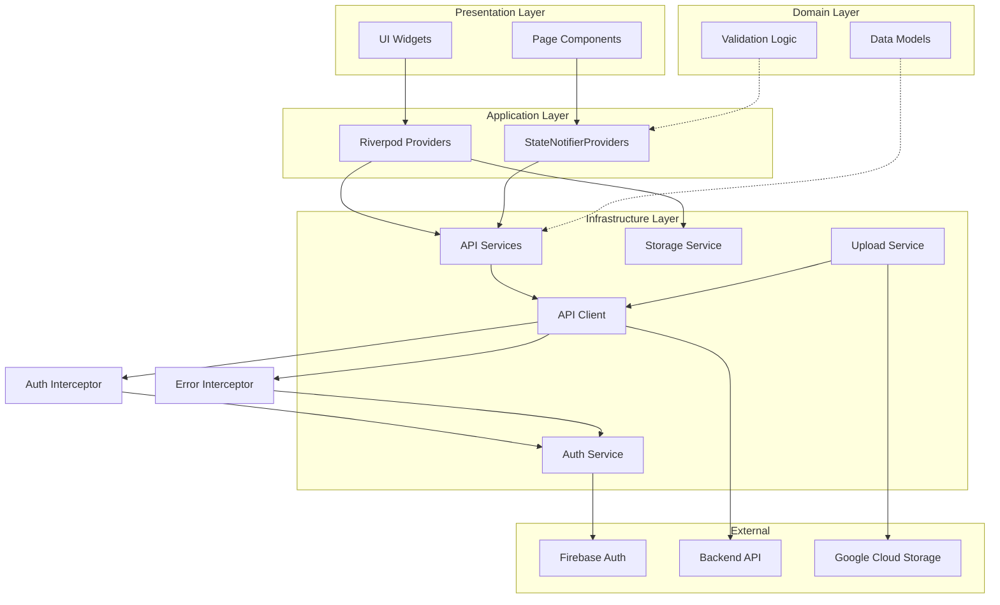
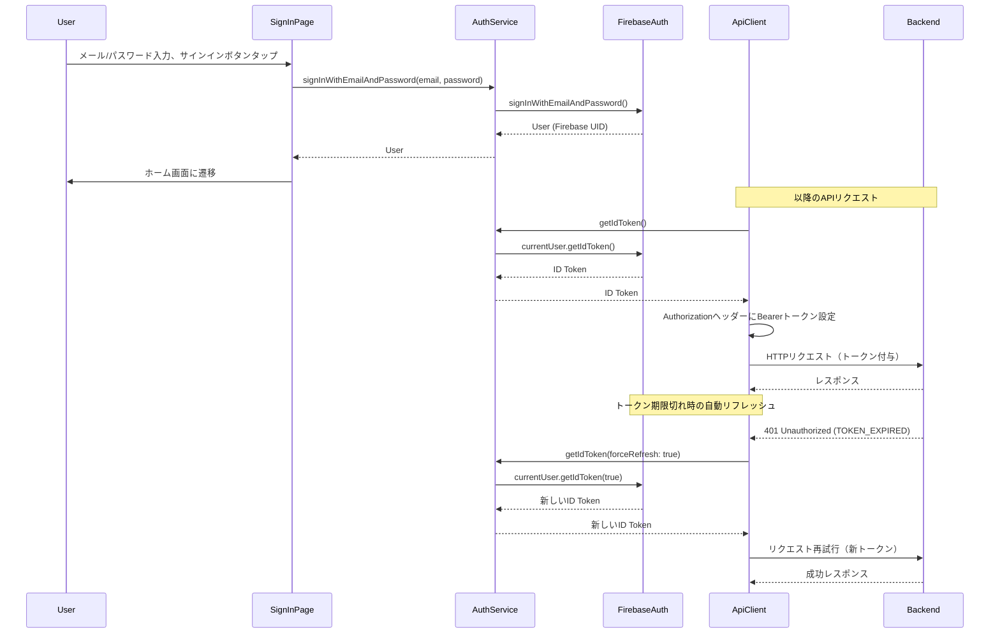
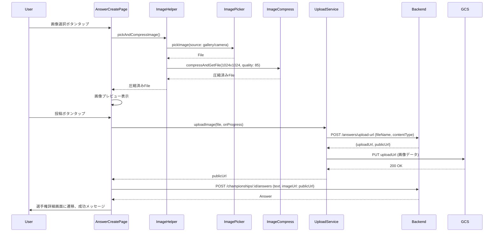
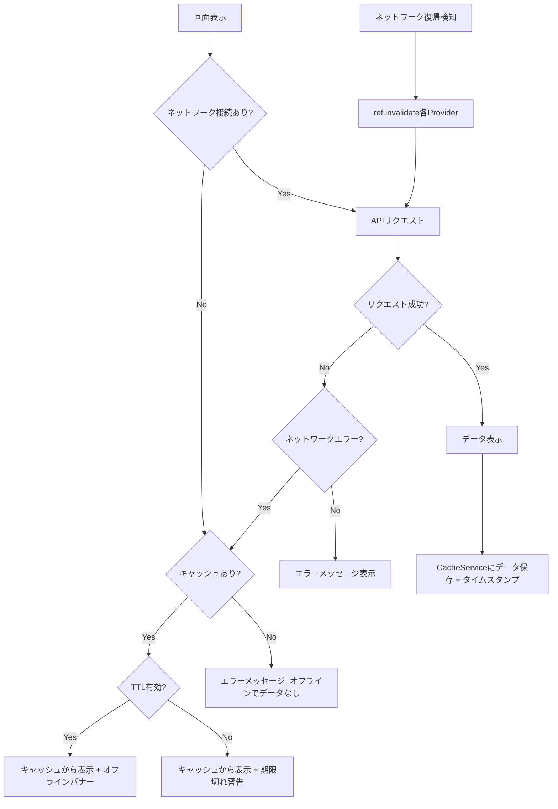

# モバイルクライアント技術設計書

## Overview

本機能は、「みんなの選手権」プラットフォームのFlutterモバイルアプリケーションにおいて、既存のUIスタブとAPI基盤を拡張し、完全に機能する大喜利プラットフォームを実現する。ユーザーは選手権の閲覧・作成、回答の投稿・編集、いいね・コメントのインタラクション、プロフィール管理を行うことができる。

**Purpose**: 既存の堅牢なAPI基盤（Riverpod + Dio + Firebase Auth）を活用し、未実装のビジネスロジック、状態管理、UI コンポーネントを追加することで、モバイルユーザーに完全な大喜利体験を提供する。

**Users**: 一般ユーザー（選手権閲覧・回答投稿）、選手権主催者（選手権作成・受賞設定）がこの機能を利用して、モバイルデバイスからプラットフォームの全機能にアクセスする。

**Impact**: 現在のスタブ状態のモバイルアプリを、バックエンドAPIと完全に統合された本番利用可能なアプリケーションに変換する。既存の`ApiClient`, `AuthService`, `ErrorInterceptor`, `UploadService`は維持し、新規にRiverpod Providerと UIコンポーネントを追加する。

### Goals
- 既存の堅牢なAPI基盤を最大限活用し、未実装のビジネスロジックと UI を追加
- Firebase Authenticationによる認証フローを実装し、全APIリクエストに自動トークン付与
- Riverpod を使用した型安全な状態管理を全画面に実装
- オフラインキャッシングとエラーハンドリングの統一実装
- 画像選択・圧縮・アップロードのエンドツーエンド実装

### Non-Goals
- バックエンドAPI仕様の変更（既存エンドポイントをそのまま使用）
- OAuth認証（Google, Apple）の実装（メール/パスワードのみ）
- いいね一覧のユーザーリスト表示（バックエンドAPI未実装のため、いいね数のみ表示）
- データベーススキーマの変更
- プッシュ通知機能

## Architecture

### Existing Architecture Analysis

モバイルアプリは以下のレイヤー構造で構成されている：

```
mobile/lib/
├── app/                    # アプリケーション層
│   ├── main_shell.dart    # ボトムナビゲーションシェル
│   └── router.dart        # go_routerルーティング設定
├── core/                   # コア層（共通機能）
│   ├── api/               # APIクライアント
│   ├── auth/              # 認証サービス
│   ├── models/            # データモデル
│   ├── services/          # APIサービス
│   └── utils/             # ユーティリティ
└── features/              # 機能層（画面別）
    ├── championship/
    ├── answer/
    └── user/
```

**既存の実装済みコンポーネント**:
- `ApiClient`: Dioベースの型安全なHTTPクライアント（ジェネリック型推論、fromJsonファクトリ）
- `AuthService`: Firebase Authentication統合（トークン取得、ログイン状態監視）
- `AuthInterceptor`: ID Token自動付与
- `ErrorInterceptor`: HTTPエラーをApiExceptionに変換、トークン自動リフレッシュ
- `ApiException`: sealed class による階層的なエラー型システム
- `StorageService`: SharedPreferencesラッパー（型安全なJSON保存・取得）
- `UploadService`: 画像アップロード（署名付きURL、バリデーション、進捗通知）
- `ChampionshipApi`, `AnswerApi`, `UserApi`: REST APIクライアント（基本メソッド実装済み）
- データモデル: `Championship`, `Answer`, `User`, `Comment`, `Like`（fromJson/toJson完備）
- Riverpod Provider設定: 依存性注入の基盤（`core/providers.dart`, `auth/auth_provider.dart`）

**既存の制約と尊重すべきパターン**:
- 命名規則: Providerサフィックス`xxxProvider`, APIクライアント`XxxApi`, サービス`XxxService`, 例外`XxxException`
- 依存性注入: Riverpod Providerで全依存関係を管理
- レイヤー分離: API → Service → Provider → UI
- 型安全: `ApiClient.get<T>`でジェネリック型推論、sealed classによるエラーハンドリング
- エラーハンドリング: DioInterceptorでHTTPエラーをApiExceptionに変換、エラーコードベースのマッピング

**技術的負債**:
- UIスタブが全画面に存在（ビジネスロジック未実装）
- StateNotifierProviderが未実装（状態管理なし）
- キャッシング機構なし
- バリデーションロジック未実装

本設計では、既存の堅牢なインフラを維持しつつ、Phase 1で最小限のファイル追加により全機能を実装し、Phase 2で共通ウィジェット抽出とProvider分割を行うハイブリッドアプローチを採用する。

### Architecture Pattern & Boundary Map

**選択されたパターン**: レイヤードアーキテクチャ + Riverpod による依存性注入



**Architecture Integration**:
- **選択パターン**: レイヤードアーキテクチャ — 各レイヤーの責任が明確で、既存のプロジェクト構造と一致
- **Domain/Feature Boundaries**:
  - `core/`: 共通機能（API、認証、ストレージ、ユーティリティ）
  - `features/championship/`: 選手権機能（一覧、詳細、作成）
  - `features/answer/`: 回答機能（詳細、作成、編集、いいね・コメント）
  - `features/user/`: ユーザー機能（プロフィール、編集、詳細）
  - `features/auth/`: 認証機能（サインイン、ログアウト）
- **既存パターンの維持**:
  - Riverpod Providerによる依存性注入
  - DioインターセプターによるHTTPリクエスト/レスポンス処理
  - sealed classによる型安全なエラーハンドリング
  - shared_preferencesによるローカルストレージ
- **新規コンポーネントの根拠**:
  - **StateNotifierProvider**: 画面ごとの状態管理（ローディング、エラー、データ）を一元管理
  - **CacheService**: オフラインキャッシング（TTL管理、キャッシュキー生成）を一元化
  - **ImageHelper**: 画像選択・圧縮ロジックを共通化
  - **SignInPage**: カスタムサインイン画面（Firebase Auth統合）
- **Steering準拠**: 既存のプロジェクト構造と命名規則を尊重、新規追加コンポーネントは最小限

### Technology Stack

| Layer | Choice / Version | Role in Feature | Notes |
|-------|------------------|-----------------|-------|
| Frontend | Flutter 3.24.0 | モバイルUI フレームワーク | 既存プロジェクトで使用中 |
| State Management | flutter_riverpod 2.5.0 | 状態管理、依存性注入 | 既存で基盤設定済み、StateNotifierProviderを新規追加 |
| Routing | go_router 14.0.0 | ルーティング、ナビゲーション | 既存で全ルート定義済み、redirectロジックを追加 |
| HTTP Client | dio 5.4.0 | REST API通信 | 既存ApiClient実装済み、Interceptor活用 |
| Authentication | firebase_auth 5.0.0 | Firebase Authentication統合 | 既存AuthService実装済み、サインインUI追加 |
| Local Storage | shared_preferences 2.2.0 | キャッシング、認証トークン保存 | 既存StorageService実装済み、CacheService追加 |
| Image Processing | image_picker 1.0.7, flutter_image_compress 2.1.0 | 画像選択、リサイズ・圧縮 | 新規追加、ネイティブ権限設定必要 |
| Network Monitoring | connectivity_plus 5.0.2 | ネットワーク状態監視 | 新規追加、オフライン対応用 |
| Date Formatting | intl 0.19.0 | 日時フォーマット | 既存で使用中 |

**新規依存関係の追加理由**:
- `image_picker`, `flutter_image_compress`: 要件12（画像アップロード）でギャラリー/カメラからの画像選択とリサイズ・圧縮が必須
- `connectivity_plus`: 要件11.3（ネットワーク復帰時の自動再取得）でネットワーク状態監視が必要

**バージョン選定根拠**: pub.devの最新安定版、Flutter 3.24.0との互換性確認済み

## System Flows

### 認証フロー



**フロー判断ポイント**:
- トークン期限切れ時: ErrorInterceptorが401エラーを検知し、自動リフレッシュ
- リフレッシュ失敗時: AuthService.signOut()を呼び出し、サインイン画面に自動遷移（GoRouter redirect）

### 画像アップロードフロー



**フロー判断ポイント**:
- 画像選択元: ユーザーがギャラリー/カメラを選択（ImagePicker.pickImage(source)）
- 圧縮失敗時: エラーメッセージ表示、リトライボタン提供
- アップロード進捗: onProgressコールバックでProgressIndicator更新

### オフラインキャッシング・リフレッシュフロー



**フロー判断ポイント**:
- ネットワーク接続: connectivity_plusでリアルタイム監視
- キャッシュTTL: 選手権一覧5分、詳細10分
- ネットワーク復帰時: connectivity_plusのStreamでオフライン→オンライン遷移を検知、各Providerを無効化して自動リフレッシュ

## Requirements Traceability

| Requirement | Summary | Components | Interfaces | Flows |
|-------------|---------|------------|------------|-------|
| 1.1 | サインイン画面表示 | SignInPage, AuthService | AuthServiceInterface | 認証フロー |
| 1.2 | サインイン成功時の認証状態保存 | AuthService, StorageService | AuthServiceInterface, StorageServiceInterface | 認証フロー |
| 1.3 | ログアウト処理 | ProfilePage, AuthService | AuthServiceInterface | - |
| 1.4 | 自動トークン付与 | AuthInterceptor | - | 認証フロー |
| 1.5 | トークン自動更新 | ErrorInterceptor, AuthService | AuthServiceInterface | 認証フロー |
| 1.6 | ログイン状態復元 | GoRouter redirect, authStateProvider | - | 認証フロー |
| 2.1-2.7 | 選手権一覧表示 | HomePage, ChampionshipListNotifier, ChampionshipApi | ChampionshipListState, ChampionshipApiInterface | - |
| 3.1-3.8 | 選手権詳細表示 | ChampionshipDetailPage, championshipDetailProvider, answerListProvider | - | - |
| 4.1-4.8 | 選手権作成 | ChampionshipCreatePage, ChampionshipCreateNotifier, ChampionshipApi | ChampionshipCreateState | - |
| 5.1-5.9 | 回答詳細表示 | AnswerDetailPage, answerDetailProvider, commentListProvider, AnswerApi | - | - |
| 6.1-6.9 | 回答作成 | AnswerCreatePage, AnswerCreateNotifier, AnswerApi, ImageHelper, UploadService | AnswerCreateState | 画像アップロードフロー |
| 7.1-7.8 | 回答編集 | AnswerEditPage, AnswerEditNotifier, AnswerApi | AnswerEditState | 画像アップロードフロー |
| 8.1-8.10 | プロフィール表示・編集 | ProfilePage, ProfileEditPage, ProfileEditNotifier, UserApi | ProfileEditState | 画像アップロードフロー |
| 9.1-9.5 | ユーザー詳細表示 | UserDetailPage, userDetailProvider, UserApi | - | - |
| 10.1-10.7 | エラーハンドリング・状態管理 | ErrorInterceptor, ErrorView, AsyncValue | ApiException | 認証フロー |
| 11.1-11.5 | オフライン対応・キャッシング | CacheService, connectivityProvider, StorageService | CacheServiceInterface | オフラインキャッシング・リフレッシュフロー |
| 12.1-12.8 | 画像アップロード | ImageHelper, UploadService | UploadServiceInterface | 画像アップロードフロー |

## Components and Interfaces

### Component Summary

| Component | Domain/Layer | Intent | Req Coverage | Key Dependencies (Criticality) | Contracts |
|-----------|--------------|--------|--------------|--------------------------|-----------|
| SignInPage | Auth/Presentation | Firebase Auth メール/パスワードサインイン画面 | 1.1, 1.2 | AuthService (P0), GoRouter (P0) | State |
| AuthService | Auth/Infrastructure | Firebase Auth統合、トークン管理 | 1.2, 1.4, 1.5, 1.6 | FirebaseAuth (P0) | Service |
| HomePage | Championship/Presentation | 選手権一覧表示、ステータス別タブ | 2.1-2.7 | ChampionshipListNotifier (P0) | State |
| ChampionshipListNotifier | Championship/Application | 選手権一覧の状態管理 | 2.1-2.7 | ChampionshipApi (P0) | State |
| ChampionshipDetailPage | Championship/Presentation | 選手権詳細・回答一覧表示 | 3.1-3.8 | championshipDetailProvider (P0), answerListProvider (P0) | - |
| ChampionshipCreatePage | Championship/Presentation | 選手権作成フォーム | 4.1-4.8 | ChampionshipCreateNotifier (P0) | State |
| ChampionshipCreateNotifier | Championship/Application | 選手権作成の状態管理、バリデーション | 4.1-4.8 | ChampionshipApi (P0) | State |
| AnswerDetailPage | Answer/Presentation | 回答詳細、いいね・コメント表示 | 5.1-5.9 | answerDetailProvider (P0), commentListProvider (P0) | - |
| AnswerCreatePage | Answer/Presentation | 回答作成フォーム、画像選択 | 6.1-6.9 | AnswerCreateNotifier (P0), ImageHelper (P0) | State |
| AnswerCreateNotifier | Answer/Application | 回答作成の状態管理、バリデーション | 6.1-6.9 | AnswerApi (P0), UploadService (P0) | State |
| AnswerEditPage | Answer/Presentation | 回答編集フォーム | 7.1-7.8 | AnswerEditNotifier (P0), ImageHelper (P0) | State |
| AnswerEditNotifier | Answer/Application | 回答編集の状態管理、バリデーション | 7.1-7.8 | AnswerApi (P0), UploadService (P0) | State |
| ProfilePage | User/Presentation | プロフィール表示 | 8.1, 8.2 | profileProvider (P0) | - |
| ProfileEditPage | User/Presentation | プロフィール編集フォーム | 8.3-8.10 | ProfileEditNotifier (P0), ImageHelper (P0) | State |
| ProfileEditNotifier | User/Application | プロフィール編集の状態管理、バリデーション | 8.3-8.10 | UserApi (P0), UploadService (P0) | State |
| UserDetailPage | User/Presentation | ユーザー詳細、投稿一覧表示 | 9.1-9.5 | userDetailProvider (P0) | - |
| CacheService | Core/Infrastructure | オフラインキャッシング、TTL管理 | 11.1-11.5 | StorageService (P0) | Service |
| ImageHelper | Core/Utility | 画像選択・圧縮ヘルパー | 12.1-12.3 | ImagePicker (P0), ImageCompress (P0) | Service |
| ErrorView | Core/Widgets | エラー表示ウィジェット | 10.4-10.6 | - | - |
| LoadingView | Core/Widgets | ローディング表示ウィジェット | 10.3 | - | - |

### Auth / Infrastructure

#### AuthService

| Field | Detail |
|-------|--------|
| Intent | Firebase Authentication統合、トークン管理、ログイン状態監視 |
| Requirements | 1.2, 1.4, 1.5, 1.6 |

**Responsibilities & Constraints**
- Firebase Authenticationとの統合（サインイン、ログアウト、トークン取得）
- トークンライフサイクル管理（自動リフレッシュ、期限チェック）
- ログイン状態の監視（Stream<User?>）

**Dependencies**
- External: FirebaseAuth（firebase_auth パッケージ） — Firebase Authentication SDK（P0）

**Contracts**: [x] Service [ ] API [ ] Event [ ] Batch [x] State

##### Service Interface
```dart
abstract class AuthServiceInterface {
  User? get currentUser;
  bool get isAuthenticated;
  Stream<User?> get authStateChanges;
  Future<String?> getIdToken({bool forceRefresh = false});
  Future<UserCredential> signInWithEmailAndPassword(String email, String password);
  Future<void> signOut();
}
```
- Preconditions: Firebase Authが初期化済み
- Postconditions: signInWithEmailAndPassword成功時、currentUserが非null
- Invariants: currentUser が null の場合、isAuthenticated は false

##### State Management
- State model: `authStateProvider` (StreamProvider<User?>), `currentUserProvider` (Provider<User?>), `isAuthenticatedProvider` (Provider<bool>)
- Persistence: ログイン状態はFirebase Authが自動永続化
- Concurrency: Firebase Authが内部で排他制御

**Implementation Notes**
- Integration: 既存の`AuthService`クラスに`signInWithEmailAndPassword`メソッドを追加
- Validation: メール形式、パスワード長のバリデーションはUI層で実施
- Risks: トークンリフレッシュ失敗時の無限ループ防止（リトライ回数制限）

#### CacheService

| Field | Detail |
|-------|--------|
| Intent | オフラインキャッシング、TTL管理、キャッシュキー生成 |
| Requirements | 11.1-11.5 |

**Responsibilities & Constraints**
- データのローカル保存・取得（JSON文字列）
- TTL（Time To Live）管理（タイムスタンプ比較）
- キャッシュキー生成（一貫性のある命名）

**Dependencies**
- Inbound: Providerから呼び出し — キャッシュ保存・取得（P0）
- Outbound: StorageService — shared_preferencesラッパー（P0）

**Contracts**: [x] Service [ ] API [ ] Event [ ] Batch [ ] State

##### Service Interface
```dart
abstract class CacheServiceInterface {
  Future<void> set<T>(String key, T value, Map<String, dynamic> Function(T) toJson);
  Future<T?> get<T>(String key, T Function(Map<String, dynamic>) fromJson, {Duration ttl});
  Future<void> remove(String key);
  Future<void> clear();
}

class CacheService implements CacheServiceInterface {
  final StorageService _storage;

  static String championshipListKey(ChampionshipStatus? status) =>
    'cache_championships_list_${status?.name ?? 'all'}';
  static String championshipDetailKey(String id) => 'cache_championship_$id';
  static String userProfileKey(String id) => 'cache_user_$id';
}
```
- Preconditions: StorageServiceが初期化済み
- Postconditions: set成功時、タイムスタンプが保存される
- Invariants: TTL超過時、getはnullを返す

**Implementation Notes**
- Integration: `core/services/cache_service.dart`に新規作成、`core/providers.dart`でProviderを追加
- Validation: TTLチェックはget時に実施、タイムスタンプはISO 8601形式で保存
- Risks: キャッシュサイズ肥大化（shared_preferencesの容量制限）、将来的にはLRU削除を実装

### Auth / Presentation

#### SignInPage

| Field | Detail |
|-------|--------|
| Intent | Firebase Auth メール/パスワードサインイン画面 |
| Requirements | 1.1, 1.2 |

**Responsibilities & Constraints**
- メール/パスワード入力フォーム表示
- バリデーション（メール形式、パスワード長6文字以上）
- AuthService呼び出し、成功時にホーム画面遷移
- エラーメッセージ表示（認証失敗、ネットワークエラー）

**Dependencies**
- Outbound: AuthService — signInWithEmailAndPassword（P0）
- Outbound: GoRouter — context.go('/')（P0）

**Contracts**: [ ] Service [ ] API [ ] Event [ ] Batch [x] State

##### State Management
- State model: ローカル状態（TextEditingController, isLoading, errorMessage）
- Persistence: なし（一時的な入力状態のみ）
- Concurrency: サインイン中はボタン無効化

**Implementation Notes**
- Integration: `features/auth/presentation/pages/sign_in_page.dart`に新規作成
- Validation: Flutter Formバリデーション、メール形式チェック（RegExp）、パスワード長チェック
- Risks: Firebase Authエラーコードの日本語化（FirebaseAuthException.codeをswitch文で変換）

### Championship / Application

#### ChampionshipListNotifier

| Field | Detail |
|-------|--------|
| Intent | 選手権一覧の状態管理（ステータス別タブ、Pull-to-Refresh） |
| Requirements | 2.1-2.7 |

**Responsibilities & Constraints**
- 選手権一覧の取得・キャッシング
- ステータスフィルタ（RECRUITING/SELECTING/ANNOUNCED）
- Pull-to-Refresh、エラーハンドリング

**Dependencies**
- Outbound: ChampionshipApi — getChampionships（P0）
- Outbound: CacheService — キャッシュ保存・取得（P1）

**Contracts**: [ ] Service [ ] API [ ] Event [ ] Batch [x] State

##### State Management
- State model: `AsyncValue<List<Championship>>`（Riverpod AsyncValue）
- Persistence: CacheServiceで5分間キャッシュ
- Concurrency: StateNotifierが排他制御

**Implementation Notes**
- Integration: `core/providers.dart`に`championshipListNotifierProvider`を追加
- Validation: なし（APIレスポンスを信頼）
- Risks: ページネーション未実装（Phase 1では全件取得、Phase 2で実装）

#### ChampionshipCreateNotifier

| Field | Detail |
|-------|--------|
| Intent | 選手権作成の状態管理、バリデーション |
| Requirements | 4.1-4.8 |

**Responsibilities & Constraints**
- フォーム入力の状態管理（title, description, durationDays）
- バリデーション（title: 1-50文字、description: 1-500文字、durationDays: 1-14日）
- ChampionshipApi呼び出し、成功時にホーム画面遷移

**Dependencies**
- Outbound: ChampionshipApi — createChampionship（P0）

**Contracts**: [ ] Service [ ] API [ ] Event [ ] Batch [x] State

##### State Management
- State model: `AsyncValue<Championship?>`（作成中/成功/失敗）
- Persistence: なし
- Concurrency: 作成中はボタン無効化

**Implementation Notes**
- Integration: `core/providers.dart`に`championshipCreateNotifierProvider`を追加
- Validation: StateNotifier内でバリデーションロジック実装、エラーメッセージを状態に含める
- Risks: durationDaysから終了日時を計算（現在時刻 + durationDays日）

### Championship / Presentation

#### HomePage

| Field | Detail |
|-------|--------|
| Intent | 選手権一覧表示、ステータス別タブ、Pull-to-Refresh |
| Requirements | 2.1-2.7 |

**Responsibilities & Constraints**
- タブ切り替え（募集中/選考中/発表済み）
- ListView.builderで選手権カード表示
- RefreshIndicatorでPull-to-Refresh
- AsyncValue.when でローディング・エラー・データ表示切り替え

**Dependencies**
- Inbound: ChampionshipListNotifier — AsyncValue<List<Championship>>（P0）

**Contracts**: [ ] Service [ ] API [ ] Event [ ] Batch [ ] State

**Implementation Notes**
- Integration: 既存の`features/championship/presentation/pages/home_page.dart`をConsumerWidgetに変更
- Validation: なし
- Risks: タブ切り替え時の不要なAPI呼び出し（各ステータスごとにProviderを分離）

#### ChampionshipDetailPage

| Field | Detail |
|-------|--------|
| Intent | 選手権詳細・回答一覧表示 |
| Requirements | 3.1-3.8 |

**Responsibilities & Constraints**
- 選手権詳細表示（タイトル、説明、ステータス、主催者、総括コメント）
- 回答一覧表示（テキスト、画像、いいね数、コメント数、受賞情報）
- ステータスがRECRUITINGの場合、「回答を投稿」ボタン表示

**Dependencies**
- Inbound: championshipDetailProvider, answerListProvider — AsyncValue（P0）

**Contracts**: [ ] Service [ ] API [ ] Event [ ] Batch [ ] State

**Implementation Notes**
- Integration: 既存の`features/championship/presentation/pages/championship_detail_page.dart`をConsumerWidgetに変更
- Validation: なし
- Risks: 回答一覧が大量の場合のパフォーマンス（ListView.builderで仮想スクロール対応済み）

#### ChampionshipCreatePage

| Field | Detail |
|-------|--------|
| Intent | 選手権作成フォーム、バリデーション |
| Requirements | 4.1-4.8 |

**Responsibilities & Constraints**
- TextFormFieldで title, description, durationDays 入力
- バリデーションエラー表示
- 作成ボタンタップでChampionshipCreateNotifier呼び出し
- 成功時にホーム画面遷移、SnackBar表示

**Dependencies**
- Inbound: ChampionshipCreateNotifier — AsyncValue（P0）

**Contracts**: [ ] Service [ ] API [ ] Event [ ] Batch [ ] State

**Implementation Notes**
- Integration: 既存の`features/championship/presentation/pages/championship_create_page.dart`をConsumerWidgetに変更
- Validation: Formバリデーション、エラーメッセージ表示
- Risks: なし

### Answer / Application

#### AnswerCreateNotifier

| Field | Detail |
|-------|--------|
| Intent | 回答作成の状態管理、バリデーション、画像アップロード |
| Requirements | 6.1-6.9 |

**Responsibilities & Constraints**
- フォーム入力の状態管理（text, imageFile）
- バリデーション（text: 1-300文字）
- 画像アップロード（UploadService呼び出し）
- AnswerApi呼び出し、成功時に選手権詳細画面に遷移

**Dependencies**
- Outbound: AnswerApi — createAnswer（P0）
- Outbound: UploadService — uploadImage（P0）

**Contracts**: [ ] Service [ ] API [ ] Event [ ] Batch [x] State

##### State Management
- State model: `AsyncValue<Answer?>`（作成中/成功/失敗）、uploadProgress: double?
- Persistence: なし
- Concurrency: 作成中はボタン無効化

**Implementation Notes**
- Integration: `core/providers.dart`に`answerCreateNotifierProvider`を追加
- Validation: StateNotifier内でバリデーション、画像アップロード中はプログレスバー表示
- Risks: 画像アップロード失敗時のリトライロジック（UploadServiceで実装）

#### AnswerEditNotifier

| Field | Detail |
|-------|--------|
| Intent | 回答編集の状態管理、バリデーション、権限チェック |
| Requirements | 7.1-7.8 |

**Responsibilities & Constraints**
- 既存回答データの取得・編集
- 権限チェック（自分の回答のみ編集可能）
- バリデーション（text: 1-300文字）
- AnswerApi呼び出し、成功時に回答詳細画面に遷移

**Dependencies**
- Outbound: AnswerApi — updateAnswer（P0）
- Outbound: UploadService — uploadImage（P1）
- Inbound: currentUserProvider — 権限チェック（P0）

**Contracts**: [ ] Service [ ] API [ ] Event [ ] Batch [x] State

##### State Management
- State model: `AsyncValue<Answer?>`（更新中/成功/失敗）
- Persistence: なし
- Concurrency: 更新中はボタン無効化

**Implementation Notes**
- Integration: `core/providers.dart`に`answerEditNotifierProvider`を追加
- Validation: 権限チェック（answer.userId == currentUser.id）、エラー時は編集画面を表示しない
- Risks: 既存画像の削除フロー（GCS側で自動削除されないため、古いURLは残る）

### Answer / Presentation

#### AnswerDetailPage

| Field | Detail |
|-------|--------|
| Intent | 回答詳細、いいね・コメント表示、インタラクション |
| Requirements | 5.1-5.9 |

**Responsibilities & Constraints**
- 回答詳細表示（テキスト、画像、投稿者、いいね数、コメント数、受賞情報）
- いいねボタン（ログイン済みユーザーのみ）
- コメント一覧・投稿（ログイン済みユーザーのみ）

**Dependencies**
- Inbound: answerDetailProvider, commentListProvider — AsyncValue（P0）
- Outbound: AnswerApi — addLike, createComment（P0）

**Contracts**: [ ] Service [ ] API [ ] Event [ ] Batch [ ] State

**Implementation Notes**
- Integration: 既存の`features/answer/presentation/pages/answer_detail_page.dart`をConsumerWidgetに変更
- Validation: コメントテキスト1-200文字
- Risks: いいね一覧のユーザーリストはバックエンドAPI未実装のため、いいね数のみ表示

#### AnswerCreatePage

| Field | Detail |
|-------|--------|
| Intent | 回答作成フォーム、画像選択・プレビュー |
| Requirements | 6.1-6.9 |

**Responsibilities & Constraints**
- TextFormFieldで text 入力、ImageHelperで画像選択
- 画像プレビュー表示
- 投稿ボタンでAnswerCreateNotifier呼び出し
- アップロード進捗表示

**Dependencies**
- Inbound: AnswerCreateNotifier — AsyncValue, uploadProgress（P0）
- Outbound: ImageHelper — pickAndCompressImage（P0）

**Contracts**: [ ] Service [ ] API [ ] Event [ ] Batch [ ] State

**Implementation Notes**
- Integration: 既存の`features/answer/presentation/pages/answer_create_page.dart`をConsumerWidgetに変更
- Validation: Formバリデーション
- Risks: 画像選択中のキャンセル処理

#### AnswerEditPage

| Field | Detail |
|-------|--------|
| Intent | 回答編集フォーム、画像置換 |
| Requirements | 7.1-7.8 |

**Responsibilities & Constraints**
- 既存回答データを編集フォームに表示
- 画像置換（新規選択時のみアップロード）
- 更新ボタンでAnswerEditNotifier呼び出し

**Dependencies**
- Inbound: AnswerEditNotifier — AsyncValue（P0）
- Outbound: ImageHelper — pickAndCompressImage（P1）

**Contracts**: [ ] Service [ ] API [ ] Event [ ] Batch [ ] State

**Implementation Notes**
- Integration: 既存の`features/answer/presentation/pages/answer_edit_page.dart`をConsumerWidgetに変更
- Validation: Formバリデーション
- Risks: 画像未選択時の既存URL維持

### User / Application

#### ProfileEditNotifier

| Field | Detail |
|-------|--------|
| Intent | プロフィール編集の状態管理、バリデーション |
| Requirements | 8.3-8.10 |

**Responsibilities & Constraints**
- フォーム入力の状態管理（displayName, bio, avatarFile, twitterUrl）
- バリデーション（displayName: 1-30文字、bio: 0-200文字）
- アバター画像アップロード
- UserApi呼び出し、成功時にプロフィール画面に遷移

**Dependencies**
- Outbound: UserApi — updateProfile（P0）
- Outbound: UploadService — uploadImage（P1）

**Contracts**: [ ] Service [ ] API [ ] Event [ ] Batch [x] State

##### State Management
- State model: `AsyncValue<User?>`（更新中/成功/失敗）
- Persistence: なし
- Concurrency: 更新中はボタン無効化

**Implementation Notes**
- Integration: `core/providers.dart`に`profileEditNotifierProvider`を追加
- Validation: StateNotifier内でバリデーション
- Risks: TwitterURL形式バリデーション（URL形式チェックのみ、Twitterドメイン検証なし）

### User / Presentation

#### ProfilePage

| Field | Detail |
|-------|--------|
| Intent | プロフィール表示、ログアウトボタン |
| Requirements | 8.1, 8.2, 1.3 |

**Responsibilities & Constraints**
- ユーザー情報表示（displayName, avatarUrl, bio, twitterUrl）
- 編集ボタンでプロフィール編集画面に遷移
- ログアウトボタンでAuthService.signOut呼び出し

**Dependencies**
- Inbound: profileProvider — AsyncValue<User>（P0）
- Outbound: AuthService — signOut（P0）

**Contracts**: [ ] Service [ ] API [ ] Event [ ] Batch [ ] State

**Implementation Notes**
- Integration: 既存の`features/user/presentation/pages/profile_page.dart`をConsumerWidgetに変更
- Validation: なし
- Risks: ログアウト後のナビゲーション（GoRouter redirectでサインイン画面に自動遷移）

#### ProfileEditPage

| Field | Detail |
|-------|--------|
| Intent | プロフィール編集フォーム、アバター画像選択 |
| Requirements | 8.3-8.10 |

**Responsibilities & Constraints**
- TextFormFieldで displayName, bio, twitterUrl 入力
- ImageHelperでアバター画像選択
- 保存ボタンでProfileEditNotifier呼び出し

**Dependencies**
- Inbound: ProfileEditNotifier — AsyncValue（P0）
- Outbound: ImageHelper — pickAndCompressImage（P1）

**Contracts**: [ ] Service [ ] API [ ] Event [ ] Batch [ ] State

**Implementation Notes**
- Integration: 既存の`features/user/presentation/pages/profile_edit_page.dart`をConsumerWidgetに変更
- Validation: Formバリデーション
- Risks: なし

#### UserDetailPage

| Field | Detail |
|-------|--------|
| Intent | ユーザー詳細、投稿一覧表示 |
| Requirements | 9.1-9.5 |

**Responsibilities & Constraints**
- ユーザー情報表示（displayName, avatarUrl, bio, twitterUrl）
- 主催選手権一覧、回答一覧をタブ表示

**Dependencies**
- Inbound: userDetailProvider, userChampionshipsProvider, userAnswersProvider — AsyncValue（P0）

**Contracts**: [ ] Service [ ] API [ ] Event [ ] Batch [ ] State

**Implementation Notes**
- Integration: 既存の`features/user/presentation/pages/user_detail_page.dart`をConsumerWidgetに変更
- Validation: なし
- Risks: 投稿一覧のページネーション未実装（Phase 1では全件取得）

### Core / Infrastructure

#### ImageHelper

| Field | Detail |
|-------|--------|
| Intent | 画像選択・圧縮ヘルパー |
| Requirements | 12.1-12.3 |

**Responsibilities & Constraints**
- ギャラリー/カメラから画像選択（ImagePicker）
- 画像リサイズ・圧縮（1024x1024px, 品質85%）
- ファイル形式・サイズバリデーション（JPEG/PNG/GIF、10MB以下）

**Dependencies**
- External: ImagePicker（image_picker パッケージ） — 画像選択（P0）
- External: ImageCompress（flutter_image_compress パッケージ） — 画像圧縮（P0）

**Contracts**: [x] Service [ ] API [ ] Event [ ] Batch [ ] State

##### Service Interface
```dart
class ImageHelper {
  static Future<File?> pickAndCompressImage({
    required ImageSource source,
    int maxWidth = 1024,
    int maxHeight = 1024,
    int quality = 85,
  }) async {
    final XFile? pickedFile = await ImagePicker().pickImage(source: source);
    if (pickedFile == null) return null;

    // ファイルサイズチェック
    final fileSize = await File(pickedFile.path).length();
    if (fileSize > 10 * 1024 * 1024) {
      throw FileTooLargeException();
    }

    // 圧縮
    final compressedFile = await FlutterImageCompress.compressAndGetFile(
      pickedFile.path,
      '${pickedFile.path}_compressed.jpg',
      minWidth: maxWidth,
      minHeight: maxHeight,
      quality: quality,
    );

    return compressedFile;
  }
}
```
- Preconditions: ImagePicker, ImageCompressパッケージが初期化済み
- Postconditions: 圧縮済みFileまたはnull（キャンセル時）
- Invariants: 圧縮後のファイルサイズは元のサイズ以下

**Implementation Notes**
- Integration: `core/utils/image_helper.dart`に新規作成
- Validation: ファイルサイズ10MB超過時は`FileTooLargeException`をスロー
- Risks: iOS/Android権限設定（Info.plist, AndroidManifest.xml）が必要

### Core / Widgets

#### ErrorView

| Field | Detail |
|-------|--------|
| Intent | エラー表示ウィジェット（再試行ボタン付き） |
| Requirements | 10.4-10.6 |

**Responsibilities & Constraints**
- ApiExceptionからエラーメッセージ抽出
- エラーアイコン、メッセージ、再試行ボタン表示
- 再試行ボタンタップでcallback実行

**Dependencies**
- None

**Contracts**: [ ] Service [ ] API [ ] Event [ ] Batch [ ] State

**Implementation Notes**
- Integration: `core/widgets/error_view.dart`に新規作成
- Validation: なし
- Risks: エラーメッセージの日本語化（ApiExceptionにエラーメッセージ含まれる）

#### LoadingView

| Field | Detail |
|-------|--------|
| Intent | ローディング表示ウィジェット（CircularProgressIndicator） |
| Requirements | 10.3 |

**Responsibilities & Constraints**
- Center + CircularProgressIndicator表示
- オプションでローディングメッセージ表示

**Dependencies**
- None

**Contracts**: [ ] Service [ ] API [ ] Event [ ] Batch [ ] State

**Implementation Notes**
- Integration: `core/widgets/loading_view.dart`に新規作成
- Validation: なし
- Risks: なし

## Data Models

### Domain Model

既存のデータモデルは以下の通り（`core/models/`）：

- **Championship**: 選手権エンティティ（id, title, description, status, startAt, endAt, summaryComment, user, answerCount, totalLikes, createdAt, updatedAt）
- **Answer**: 回答エンティティ（id, championshipId, userId, text, imageUrl, awardType, awardComment, likeCount, commentCount, createdAt, updatedAt, user）
- **User**: ユーザーエンティティ（id, displayName, avatarUrl, bio, twitterUrl, createdAt）
- **UserSummary**: ユーザーサマリー（id, displayName, avatarUrl）
- **Comment**: コメントエンティティ（id, answerId, userId, text, createdAt, user）
- **Like**: いいねエンティティ（id, answerId, userId, createdAt）
- **ChampionshipStatus**: enum（RECRUITING, SELECTING, ANNOUNCED）
- **AwardType**: enum（GRAND_PRIZE, PRIZE, SPECIAL_PRIZE）

**新規追加モデル**: なし（既存モデルで要件を満たす）

**Aggregates**:
- **Championship** は回答（Answer）のルートエンティティ
- **Answer** はコメント（Comment）といいね（Like）のルートエンティティ

**Business Rules**:
- 選手権のステータスがRECRUITINGの場合のみ回答投稿可能
- 選手権のステータスがSELECTINGの場合のみ受賞設定可能
- 回答の編集は投稿者のみ可能
- いいねは1ユーザー1回答につき1回のみ（重複禁止）

### Data Contracts & Integration

#### API Data Transfer

**UserApi**:
```dart
// GET /users/:id
class UserResponse {
  final String id;
  final String displayName;
  final String? avatarUrl;
  final String? bio;
  final String? twitterUrl;
  final DateTime createdAt;
}

// PATCH /users/me
class UpdateProfileRequest {
  final String? displayName;
  final String? bio;
  final String? avatarUrl;
  final String? twitterUrl;
}
```

**AnswerApi**:
```dart
// GET /answers/:id/comments
class CommentListResponse {
  final List<Comment> items;
  final PaginationMeta meta;
}

// POST /answers/:id/comments
class CreateCommentRequest {
  final String text; // 1-200文字
}
```

**ChampionshipApi**:
```dart
// POST /championships
class CreateChampionshipRequest {
  final String title; // 1-50文字
  final String description; // 1-500文字
  final int durationDays; // 1-14日
}
```

**Serialization Format**: JSON（既存のfromJson/toJsonメソッド活用）

**Validation Rules**:
- リクエストボディのバリデーションはバックエンドで実施（Zodスキーマ）
- クライアント側でもUI層でバリデーション実施（早期フィードバック）

## Error Handling

### Error Strategy

**エラーカテゴリ**:
1. **User Errors（4xx）**: バリデーションエラー、認証エラー、権限エラー、リソース不在
2. **System Errors（5xx）**: サーバーエラー、タイムアウト、ネットワークエラー
3. **Business Logic Errors（422）**: ステータス不正、重複いいね

**エラーハンドリングパターン**:
- `ErrorInterceptor`でHTTPエラーをApiExceptionに変換（既存実装）
- UI層で`AsyncValue.error`をキャッチし、ErrorViewウィジェット表示
- 401エラー時はAuthService.signOut()を呼び出し、GoRouter redirectでサインイン画面に遷移

### Error Categories and Responses

**User Errors（4xx）**:
- `ValidationError（400）`: バリデーションエラー詳細をフィールド別に表示（TextFormField.errorText）
- `UnauthorizedException（401）`: 自動ログアウト→サインイン画面遷移
- `ForbiddenException（403）`: 「権限がありません」メッセージ表示
- `NotFoundException（404）`: 「リソースが見つかりません」メッセージ表示、戻るボタン提供
- `ConflictException（409）`: 「既にいいねしています」などのメッセージ表示

**System Errors（5xx）**:
- `ServerException（500）`: 「サーバーエラーが発生しました。しばらくしてから再度お試しください」
- `NetworkException`: 「インターネット接続を確認してください」、キャッシュフォールバック
- `ApiTimeoutException`: 「リクエストがタイムアウトしました」、リトライボタン

**Business Logic Errors（422）**:
- `INVALID_STATUS`: 「募集中の選手権のみ回答を投稿できます」などのコンテキストメッセージ表示

### Monitoring

- エラーログ: `ErrorInterceptor`でDioExceptionをログ出力（開発時のみ）
- 本番環境: Firebase CrashlyticsまたはSentryを将来導入検討（Phase 2）

## Testing Strategy

### Unit Tests
- `AuthService.signInWithEmailAndPassword`: 成功/失敗ケース、トークン取得
- `CacheService.get/set`: TTL有効/無効ケース、キャッシュキー生成
- `ImageHelper.pickAndCompressImage`: 圧縮成功、ファイルサイズ超過エラー
- `ChampionshipCreateNotifier`: バリデーション成功/失敗、API呼び出し成功/失敗
- `AnswerCreateNotifier`: 画像アップロード成功/失敗、API呼び出し成功/失敗

### Integration Tests
- 認証フロー: サインイン成功→ホーム画面遷移→ログアウト→サインイン画面遷移
- 選手権作成フロー: フォーム入力→API呼び出し→一覧画面リフレッシュ
- 回答投稿フロー: 画像選択→圧縮→アップロード→API呼び出し→詳細画面遷移
- エラーハンドリング: ネットワークエラー→キャッシュフォールバック→ネットワーク復帰→リフレッシュ

### E2E/UI Tests
- ホーム画面: 選手権一覧表示、タブ切り替え、Pull-to-Refresh
- 選手権詳細画面: 回答一覧表示、回答投稿ボタン（ステータス別）
- 回答作成画面: 画像選択、プレビュー、投稿、アップロード進捗
- プロフィール編集画面: フォーム入力、バリデーション、アバター画像選択

### Performance Tests
- 大量選手権データ（100件）の一覧表示: ListView.builderで仮想スクロール
- 画像アップロード: 10MB画像の圧縮・アップロード時間測定
- キャッシュ読み込み: shared_preferencesからの大量データ読み込み速度

## Security Considerations

**Authentication**:
- Firebase Authenticationによる認証（メール/パスワード）
- ID Tokenの自動付与・リフレッシュ（AuthInterceptor, ErrorInterceptor）
- トークン期限切れ時の自動ログアウト

**Authorization**:
- バックエンドでFirebase ID Tokenを検証（requireAuth middleware）
- クライアント側で権限チェック（回答編集時、自分の回答のみ）

**Data Protection**:
- HTTPS通信（Dio default）
- 認証トークンの暗号化保存（Firebase Authが自動処理）
- ユーザー入力のサニタイゼーション（バックエンドで実施）

**Input Validation**:
- クライアント側バリデーション（UI層）
- バックエンド側バリデーション（Zodスキーマ）
- 画像ファイル形式・サイズチェック（ImageHelper, UploadService）

## Performance & Scalability

**Target Metrics**:
- 初回画面表示: 2秒以内（キャッシュあり: 0.5秒以内）
- 画像アップロード: 10MB画像を10秒以内
- API レスポンス: 500ms以内（バックエンド側の目標）

**Caching Strategies**:
- 選手権一覧: 5分間キャッシュ（TTL）
- 選手権詳細: 10分間キャッシュ
- ユーザー情報: 10分間キャッシュ
- 画像: cached_network_imageパッケージで自動キャッシュ（Phase 2で導入検討）

**Optimization Techniques**:
- ListView.builderで仮想スクロール（大量データ対応）
- 画像圧縮（1024x1024px, 品質85%）でネットワーク帯域削減
- ページネーション（Phase 2で実装、20件/ページ）
- 画像遅延ロード（cached_network_image導入検討）
