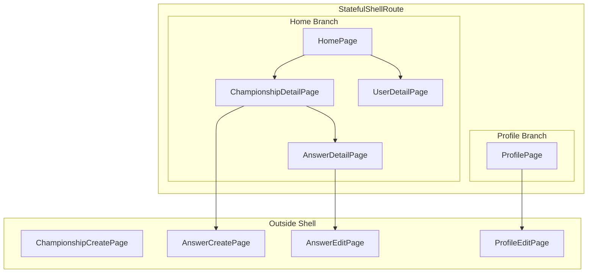
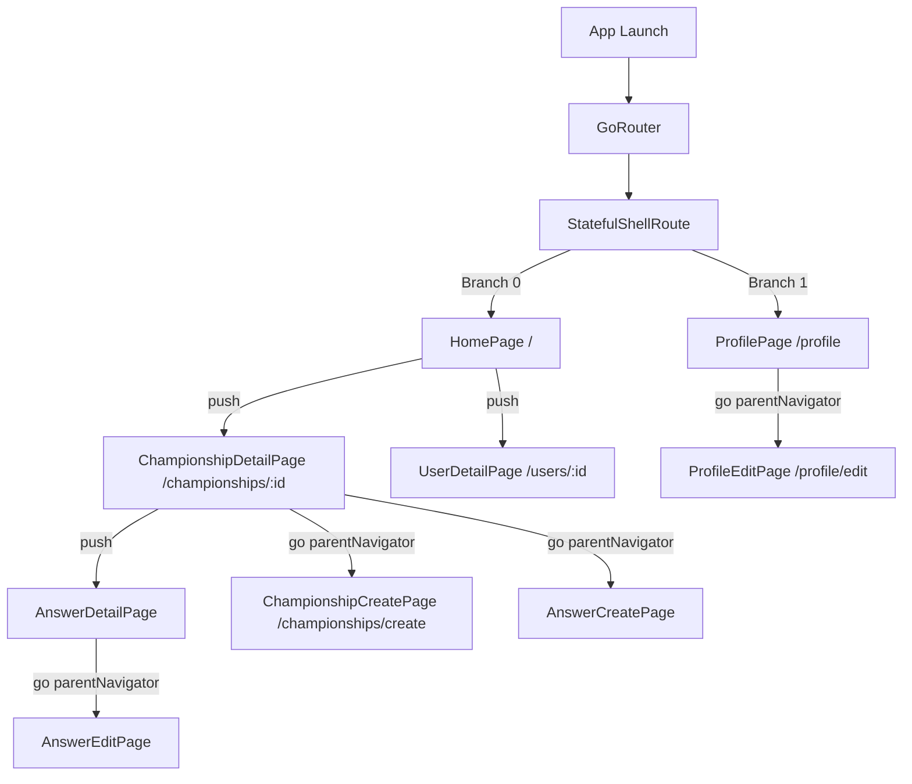

# Design Document: Page Navigation Setup

## Overview

**Purpose**: 本フィーチャーは、「みんなの選手権」Flutterモバイルアプリにおけるナビゲーション基盤を提供する。go_routerを使用した画面遷移構造の定義と、各画面の空ファイル作成により、以降の機能実装の土台を構築する。

**Users**: 開発者がこの基盤を利用して各画面の実装を進める。エンドユーザーはボトムナビゲーションを通じてホームとマイページ間をシームレスに移動できる。

**Impact**: mobileディレクトリに新規Flutterプロジェクトを作成し、ルーティング構造と機能別ディレクトリを確立する。

### Goals
- go_routerを使用した宣言的ルーティング構造の確立
- StatefulShellRouteによるボトムナビゲーションの状態保持
- 機能別（championship, answer, user）ディレクトリ構造での画面ファイル配置
- プレースホルダーUIを含む空ページの作成

### Non-Goals
- 各画面の具体的なUI実装
- API連携やデータ取得ロジック
- 認証フローの実装（auth feature のディレクトリのみ作成）

## Architecture

### Architecture Pattern & Boundary Map



**Architecture Integration**:
- **Selected pattern**: Feature-first architecture with go_router declarative routing
- **Domain/feature boundaries**: championship, answer, user, auth の4つの機能ドメインに分離
- **Existing patterns preserved**: README.mdに定義された `lib/features/[feature]/presentation/pages/` 構造を採用
- **New components rationale**: 各機能ドメインにpagesディレクトリを作成し、画面ファイルを配置
- **Steering compliance**: プロジェクトの技術スタック（Flutter、Riverpod、go_router）に準拠

### Technology Stack

| Layer | Choice / Version | Role in Feature | Notes |
|-------|------------------|-----------------|-------|
| Frontend | Flutter 3.24+ | モバイルアプリフレームワーク | pubspec.yamlで指定 |
| Routing | go_router ^14.0.0 | 宣言的ルーティング管理 | StatefulShellRoute使用 |
| State Management | flutter_riverpod ^2.5.0 | 状態管理、ConsumerWidget | 将来の画面実装で使用 |

## System Flows

### Screen Navigation Flow



**Key Decisions**:
- ボトムナビゲーション表示時の画面（詳細表示系）は Shell 内にネスト
- フルスクリーン操作（作成・編集）は parentNavigatorKey で Shell 外に配置

## Requirements Traceability

| Requirement | Summary | Components | Interfaces | Flows |
|-------------|---------|------------|------------|-------|
| 1.1 | ルートパス定義 | AppRouter | GoRouter config | Navigation Flow |
| 1.2 | go_router使用 | AppRouter | - | - |
| 1.3 | router.dart集約 | AppRouter | - | - |
| 2.1 | ディレクトリ構造 | All Pages | - | - |
| 2.2 | StatelessWidget形式 | All Pages | - | - |
| 2.3 | スネークケース命名 | All Pages | - | - |
| 3.1, 3.2, 3.3 | ホーム画面 | HomePage | - | Navigation Flow |
| 4.1, 4.2, 4.3 | 選手権画面 | ChampionshipDetailPage, ChampionshipCreatePage | - | Navigation Flow |
| 5.1, 5.2, 5.3, 5.4 | 回答画面 | AnswerDetailPage, AnswerCreatePage, AnswerEditPage | - | Navigation Flow |
| 6.1, 6.2, 6.3, 6.4 | ユーザー画面 | ProfilePage, ProfileEditPage, UserDetailPage | - | Navigation Flow |
| 7.1, 7.2, 7.3 | ナビゲーション一貫性 | AppRouter, All Pages | - | Navigation Flow |
| 8.1, 8.2, 8.3 | ボトムナビゲーション | MainShell, AppRouter | - | Navigation Flow |

## Components and Interfaces

| Component | Domain/Layer | Intent | Req Coverage | Key Dependencies | Contracts |
|-----------|--------------|--------|--------------|------------------|-----------|
| AppRouter | App/Router | ルーティング設定の一元管理 | 1.1-1.3, 7.1-7.3, 8.1-8.3 | go_router (P0) | Service |
| MainShell | App/Shell | ボトムナビゲーションシェル | 8.1-8.3 | AppRouter (P0) | State |
| HomePage | Championship/Pages | ホーム画面（選手権一覧） | 3.1-3.3 | MainShell (P0) | - |
| ChampionshipDetailPage | Championship/Pages | 選手権詳細画面 | 4.1, 4.3 | AppRouter (P0) | - |
| ChampionshipCreatePage | Championship/Pages | 選手権作成画面 | 4.2 | AppRouter (P0) | - |
| AnswerDetailPage | Answer/Pages | 回答詳細画面 | 5.1, 5.4 | AppRouter (P0) | - |
| AnswerCreatePage | Answer/Pages | 回答投稿画面 | 5.2, 5.4 | AppRouter (P0) | - |
| AnswerEditPage | Answer/Pages | 回答編集画面 | 5.3, 5.4 | AppRouter (P0) | - |
| ProfilePage | User/Pages | マイページ | 6.1 | MainShell (P0) | - |
| ProfileEditPage | User/Pages | プロフィール編集画面 | 6.2 | AppRouter (P0) | - |
| UserDetailPage | User/Pages | ユーザー詳細画面 | 6.3, 6.4 | AppRouter (P0) | - |

### App Layer

#### AppRouter

| Field | Detail |
|-------|--------|
| Intent | アプリ全体のルーティング設定を一元管理し、画面遷移を制御する |
| Requirements | 1.1, 1.2, 1.3, 7.1, 7.2, 7.3, 8.1, 8.2, 8.3 |

**Responsibilities & Constraints**
- 全ルートパスの定義と画面へのマッピング
- StatefulShellRouteによるボトムナビゲーション管理
- ディープリンク対応のURL構造

**Dependencies**
- External: go_router — ルーティングライブラリ (P0)
- Outbound: All Pages — 各画面への遷移 (P0)

**Contracts**: Service [x] / State [ ]

##### Service Interface
```dart
// lib/app/router.dart

final rootNavigatorKey = GlobalKey<NavigatorState>();
final shellNavigatorKey = GlobalKey<NavigatorState>();

final goRouter = GoRouter(
  navigatorKey: rootNavigatorKey,
  initialLocation: '/',
  routes: [
    StatefulShellRoute.indexedStack(
      builder: (context, state, navigationShell) => MainShell(
        navigationShell: navigationShell,
      ),
      branches: [
        // Home Branch
        StatefulShellBranch(
          routes: [
            GoRoute(
              path: '/',
              builder: (context, state) => const HomePage(),
              routes: [
                GoRoute(
                  path: 'championships/:id',
                  builder: (context, state) => ChampionshipDetailPage(
                    id: state.pathParameters['id']!,
                  ),
                  routes: [
                    GoRoute(
                      path: 'answers/:answerId',
                      builder: (context, state) => AnswerDetailPage(
                        championshipId: state.pathParameters['id']!,
                        answerId: state.pathParameters['answerId']!,
                      ),
                    ),
                  ],
                ),
                GoRoute(
                  path: 'users/:id',
                  builder: (context, state) => UserDetailPage(
                    id: state.pathParameters['id']!,
                  ),
                ),
              ],
            ),
          ],
        ),
        // Profile Branch
        StatefulShellBranch(
          routes: [
            GoRoute(
              path: '/profile',
              builder: (context, state) => const ProfilePage(),
            ),
          ],
        ),
      ],
    ),
    // Outside Shell Routes
    GoRoute(
      parentNavigatorKey: rootNavigatorKey,
      path: '/championships/create',
      builder: (context, state) => const ChampionshipCreatePage(),
    ),
    GoRoute(
      parentNavigatorKey: rootNavigatorKey,
      path: '/championships/:id/answers/create',
      builder: (context, state) => AnswerCreatePage(
        championshipId: state.pathParameters['id']!,
      ),
    ),
    GoRoute(
      parentNavigatorKey: rootNavigatorKey,
      path: '/championships/:championshipId/answers/:answerId/edit',
      builder: (context, state) => AnswerEditPage(
        championshipId: state.pathParameters['championshipId']!,
        answerId: state.pathParameters['answerId']!,
      ),
    ),
    GoRoute(
      parentNavigatorKey: rootNavigatorKey,
      path: '/profile/edit',
      builder: (context, state) => const ProfileEditPage(),
    ),
  ],
);
```

**Implementation Notes**
- Integration: MaterialApp.router で GoRouter を設定
- Validation: pathParameters の null チェックを各ページで実施
- Risks: ルートパスの重複や競合に注意

---

#### MainShell

| Field | Detail |
|-------|--------|
| Intent | ボトムナビゲーションバーを持つシェルUIを提供し、タブ間遷移を管理 |
| Requirements | 8.1, 8.2, 8.3 |

**Responsibilities & Constraints**
- BottomNavigationBar の表示
- 現在のタブインデックスの管理
- navigationShell.goBranch による遷移

**Dependencies**
- Inbound: AppRouter — StatefulShellRouteから呼び出し (P0)
- Outbound: HomePage, ProfilePage — 各タブの画面 (P0)

**Contracts**: State [x]

##### State Management
```dart
// lib/app/main_shell.dart

class MainShell extends StatelessWidget {
  const MainShell({
    required this.navigationShell,
    super.key,
  });

  final StatefulNavigationShell navigationShell;

  @override
  Widget build(BuildContext context) {
    return Scaffold(
      body: navigationShell,
      bottomNavigationBar: NavigationBar(
        selectedIndex: navigationShell.currentIndex,
        onDestinationSelected: (index) {
          navigationShell.goBranch(
            index,
            initialLocation: index == navigationShell.currentIndex,
          );
        },
        destinations: const [
          NavigationDestination(
            icon: Icon(Icons.home_outlined),
            selectedIcon: Icon(Icons.home),
            label: 'ホーム',
          ),
          NavigationDestination(
            icon: Icon(Icons.person_outline),
            selectedIcon: Icon(Icons.person),
            label: 'マイページ',
          ),
        ],
      ),
    );
  }
}
```

**Implementation Notes**
- Integration: NavigationBar（Material 3）を使用
- Validation: currentIndex が有効な範囲内であることを確認
- Risks: タブ数変更時はdestinationsも更新必要

---

### Championship Domain

#### HomePage

| Field | Detail |
|-------|--------|
| Intent | アプリのエントリーポイント、選手権一覧のプレースホルダー表示 |
| Requirements | 3.1, 3.2, 3.3 |

**Responsibilities & Constraints**
- デフォルト画面として表示
- 選手権一覧のプレースホルダーUI

**Dependencies**
- Inbound: MainShell — ボトムナビゲーションから表示 (P0)

**Contracts**: -（プレースホルダーのみ）

##### Implementation Notes
- プレースホルダーテキスト「選手権一覧」を中央に表示
- StatelessWidget として実装

---

#### ChampionshipDetailPage

| Field | Detail |
|-------|--------|
| Intent | 選手権の詳細情報を表示 |
| Requirements | 4.1, 4.3 |

**Responsibilities & Constraints**
- 選手権IDをパラメータとして受け取る
- 選手権詳細のプレースホルダーUI

**Dependencies**
- Inbound: AppRouter — パスパラメータから id を受け取る (P0)

**Contracts**: -

##### Implementation Notes
- `id` パラメータを required で受け取る
- AppBar に戻るボタンを自動表示

---

#### ChampionshipCreatePage

| Field | Detail |
|-------|--------|
| Intent | 新規選手権を作成 |
| Requirements | 4.2 |

**Responsibilities & Constraints**
- フルスクリーン（ボトムナビ非表示）
- 選手権作成のプレースホルダーUI

**Dependencies**
- Inbound: AppRouter — parentNavigatorKey でシェル外に配置 (P0)

**Contracts**: -

---

### Answer Domain

#### AnswerDetailPage

| Field | Detail |
|-------|--------|
| Intent | 回答の詳細情報を表示 |
| Requirements | 5.1, 5.4 |

**Responsibilities & Constraints**
- championshipId と answerId をパラメータとして受け取る

**Dependencies**
- Inbound: AppRouter — パスパラメータを受け取る (P0)

**Contracts**: -

---

#### AnswerCreatePage

| Field | Detail |
|-------|--------|
| Intent | 新規回答を投稿 |
| Requirements | 5.2, 5.4 |

**Responsibilities & Constraints**
- championshipId をパラメータとして受け取る
- フルスクリーン

**Dependencies**
- Inbound: AppRouter — parentNavigatorKey でシェル外に配置 (P0)

**Contracts**: -

---

#### AnswerEditPage

| Field | Detail |
|-------|--------|
| Intent | 既存回答を編集 |
| Requirements | 5.3, 5.4 |

**Responsibilities & Constraints**
- championshipId と answerId をパラメータとして受け取る
- フルスクリーン

**Dependencies**
- Inbound: AppRouter — parentNavigatorKey でシェル外に配置 (P0)

**Contracts**: -

---

### User Domain

#### ProfilePage

| Field | Detail |
|-------|--------|
| Intent | ログインユーザーのマイページを表示 |
| Requirements | 6.1 |

**Responsibilities & Constraints**
- ボトムナビゲーションのタブとして表示

**Dependencies**
- Inbound: MainShell — ボトムナビゲーションから表示 (P0)

**Contracts**: -

---

#### ProfileEditPage

| Field | Detail |
|-------|--------|
| Intent | プロフィールを編集 |
| Requirements | 6.2 |

**Responsibilities & Constraints**
- フルスクリーン

**Dependencies**
- Inbound: AppRouter — parentNavigatorKey でシェル外に配置 (P0)

**Contracts**: -

---

#### UserDetailPage

| Field | Detail |
|-------|--------|
| Intent | 他ユーザーのプロフィールを表示 |
| Requirements | 6.3, 6.4 |

**Responsibilities & Constraints**
- id をパラメータとして受け取る

**Dependencies**
- Inbound: AppRouter — パスパラメータから id を受け取る (P0)

**Contracts**: -

---

## Data Models

本フィーチャーではデータモデルは定義しない。ルーティングに必要なパラメータ（id, championshipId, answerId）は String 型として各ページに渡される。

## Error Handling

### Error Strategy
ルーティングレベルでのエラーハンドリング：

- **存在しないパス**: GoRouter のデフォルト errorBuilder または redirect で処理
- **不正なパラメータ**: 各ページで null チェック後、適切なエラー画面またはリダイレクト

### Error Categories and Responses
- **404 Not Found**: 未定義ルートへのアクセス → ホーム画面へリダイレクト
- **Invalid Parameter**: pathParameters が null → エラー画面表示またはリダイレクト

## Testing Strategy

### Unit Tests
- AppRouter のルート定義が正しいこと
- 各パスが適切な画面にマッピングされること

### Integration Tests
- ボトムナビゲーションでタブ切り替えが動作すること
- 詳細画面から戻るボタンで前の画面に戻ること
- シェル外ルートでボトムナビが非表示になること

### Widget Tests
- 各ページWidgetが正しくレンダリングされること
- プレースホルダーテキストが表示されること
